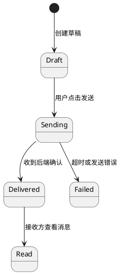
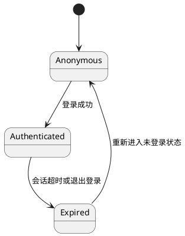
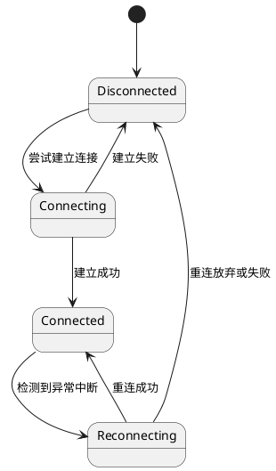
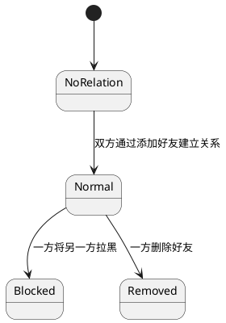
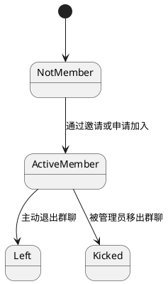
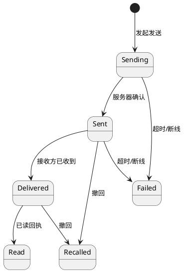

# ShirohaChat 项目文档

## 摘要

在人类沟通长期依赖书信等传统方式的阶段,信息传递的延迟与成本长期存在:跨地域沟通困难、往返周期长,在“等待回信”的过程中,关键信息往往滞后甚至错过最佳时点。手机普及与移动互联网兴起后,人们对“随时联系、即时回应”的需求迅速成为日常生活的刚需,即时通讯由此从工具性产品演进为社会连接的基础设施,以更低成本、更高频率支撑人与人之间更及时、更亲密的沟通。

在这一背景下,本项目拟开发一款面向大众的普适即时通讯工具——ShirohaChat(桌面端)。产品聚焦日常沟通场景,服务朋友、家人、异地恋与同学等社交关系维护需求,围绕“及时触达、顺畅表达、稳定可靠、隐私可控”四个方向构建核心体验,覆盖私聊/群聊、文本/图片/语音/表情与文件发送、离线消息与重连、已读未读与消息搜索等基础能力,满足大众用户对即时联系与低成本连接的长期需求。

在开发过程中,团队基于面向对象分析与设计方法(OOAD)和统一建模语言(UML)进行系统建模,采用客户端-服务器架构(C/S)实现消息实时传递。项目引入**非功能性需求(NFR)**管理、**协议契约设计**、**风险管理矩阵**与**量化性能指标**。系统实现端到端延迟 ≤ 200ms、消息送达率 ≥ 99.99%、单节点支持 ≥ 5000 并发连接,具备断线重连与离线补发机制,确保消息零丢失。

关键词:大众即时通讯,社交沟通,私聊,群聊,离线消息,消息可靠性,低延迟,NFR

---

## 日期 / 修改 / 描述 / 作者

---

## 目录

* 摘要
* 第1章 立项

  * 1.1 项目起源与提案
  * 1.2 Business Case
* 第2章 愿景

  * 2.1 问题陈述
  * 2.2 涉众与用户
  * 2.3 关键涉众和用户的需要
  * 2.4 产品概述
  * 2.5 产品特性
  * 2.6 其他产品需求
* 第3章 用况建模

  * 3.1 术语表
  * 3.2 主要用况
  * 3.3 用况的完整描述
* 第4章 需求分析
* 第5章 架构设计
* 第6章 详细设计
* 后记
* 参考文献

---

# 第1章 立项

## 1.1 项目起源与提案

### 项目背景

在书信等传统沟通方式主导的年代,信息传递延迟高、成本高,跨地域沟通尤为困难,人与人之间的联系往往被时间与距离切割。手机普及后,人们对“随时联系、即时回应”的需求迅速增长,即时通讯成为日常生活的基础设施:它不仅承担信息传递,也承载关系维护、情感表达与社交连接。

在大众沟通场景中,用户对即时通讯的核心期待并不复杂,但要求极高:要快、要稳、要省心、要可信。若基础体验存在短板,会直接放大沟通成本与情绪摩擦,主要体现在三类问题:

**1. 聊天入口多，重要信息难定位**
* 私聊与群聊同时进行,对话入口繁杂
* 约定时间、地址、转账说明等关键信息容易被刷屏淹没
* 回看成本高,错过信息后需要二次确认

**2. 表达与互动能力需要完整覆盖**
大众沟通不仅是“发文字”,还包括语音、图片、表情与文件等多模态表达,并需要引用、转发、撤回等高频互动能力,以降低误解与重复沟通。

**3. 弱网与离线场景下的可靠性与隐私诉求突出**
在网络波动、断线重连、设备切换等场景下,用户更关注“消息是否到达、是否重复、是否丢失”;同时,对隐私设置、黑名单与骚扰拦截也有明确预期。

### 项目定位

> **"一款面向大众的普适桌面端即时通讯工具,聚焦朋友与家人等日常社交关系维护,以低延迟、高可靠与隐私可控为基础,提供私聊/群聊与多媒体表达能力,满足随时联系、即时回应的沟通刚需。"**

### 核心价值主张

* **更及时**:降低“联系到对方”的等待成本,让沟通回到即时与自然的节奏
* **更亲密**:以语音、图片、表情等表达方式承载情绪与关系温度
* **更低成本**:让跨地域沟通与群体沟通不再受制于时间与费用
* **更可靠**:在弱网与断线情况下保持一致体验,尽量减少丢失与重复

## 1.2 Business Case

### 项目目标

开发一款**高性能、高可用**的普适即时通讯系统,采用MoSCoW方法进行功能优先级管理:

#### Must Have (MVP核心)
1. 账号体系(手机号/邮箱注册登录)
2. 联系人体系(添加/删除/备注/黑名单)
3. 私聊/群聊
4. 文本/图片/语音/表情消息
5. 文件发送(小文件)
6. Server-ACK机制
7. 离线消息拉取
8. 桌面客户端

#### Should Have
1. 搜索(按关键词/联系人/群组)
2. 已读/未读与未读计数
3. 置顶会话与消息引用回复
4. 消息撤回与转发

#### Could Have
1. 消息收藏
2. 群公告与群管理(入群方式、禁言、管理员)
3. 断网/弱网重连动画
4. 陌生人消息请求与反骚扰策略(开关、频控、举报)

#### Won't Have (本轮不做)
1. 视频/语音通话
2. 多端同步
3. 实时协作文档

### 预期收益

* **用户价值(大众用户)**:随时联系、即时回应,跨地域沟通成本显著降低,社交关系维护更自然、更稳定
* **用户价值(群体关系)**:群聊信息更清晰,重要信息更不易错过,降低重复确认与误解成本
* **技术价值**:提供零丢失、低延迟(≤200ms)、稳定可靠的实时通讯服务
* **学习价值**:完整展示IM系统的工业级架构设计,包含NFR管理、协议设计、可靠性机制与性能压测方法

### 约束与假设

| 维度   | 约束条件                              |
| ---- | --------------------------------- |

### 非功能性需求 (NFR)

| 维度   | 指标要求            | 验证方法              |
| ---- | --------------- | ----------------- |

---

# 第2章 愿景

## 2.1 问题陈述

### 问题一：即时联系成为刚需,基础体验要求更高

| 要素   | 描述                                                                  |
| ---- | ------------------------------------------------------------------- |
| 问题   | 手机普及后,“随时联系、即时回应”成为大众沟通的基本预期,但在弱网、断线、设备切换与高频群聊等场景下,消息到达与阅读状态不确定、重要信息易错过、回看与检索成本高等问题依然普遍存在。 |
| 影响群体 | 大众用户(朋友、家人、异地恋、同学等社交关系)、需要跨地域保持联系的人群。                                   |
| 后果   | 错过关键信息、反复确认造成沟通疲劳,并在高频互动中引发误解与情绪摩擦,抬高关系维护成本。          |
| 解决方案 | ShirohaChat 聚焦“及时触达与稳定可靠”:提供 Server-ACK、离线补发与断线重连,并配套清晰的未读计数、搜索与隐私/反骚扰设置,让沟通更省心。 |

### 问题二：现有方案的技术局限

| 要素   | 描述                                                 |
| ---- | -------------------------------------------------- |
| 问题   | 主流闭源 IM 系统难以进行架构研究与二次开发，开源方案多为 Demo 级别，缺乏工业级设计。 |
| 影响群体 | 软件工程学习者、系统架构研究者。                                   |
| 后果   | 理论与实践脱节，无法深入理解 WebSocket、消息可靠性、分布式状态管理等核心技术。    |
| 解决方案 | ShirohaChat 开源完整架构设计（含 NFR、协议、风险管理），可作为学习与扩展基础。   |

---

## 2.2 涉众与用户

### 1. 涉众分析

| 涉众类型  | 代表       | 核心诉求                           | 优先级  |
| ----- | -------- | ------------------------------ | ---- |
| 项目团队  | 开发组/测试组  | 掌握工业级 IM 架构设计与实现能力              | 高    |
| 目标用户  | 大众用户     | 稳定、易用的日常即时通讯工具                 | 高    |
| 技术评审者 | 导师/面试官   | 系统展示专业性（架构、性能、文档）              | 高    |
| 潜在扩展者 | 开源社区开发者  | 清晰的代码结构与接口文档                   | 中    |

### 2. 用户画像(典型大众场景)

#### 小周 - 异地恋用户

* **场景**:日常高频私聊,需要在不同时间与地点保持“随时联系、即时回应”
* **痛点**:
  - 弱网或断线时消息状态不明确,容易产生“是否收到”的焦虑
  - 夜间或工作时段需要更细粒度的通知与免打扰控制
  - 希望表达更自然(语音、图片、表情),但不希望操作复杂
* **期望**:消息到达更确定、通知可控、表达顺畅且操作简单

#### 阿慧 - 家庭群组织者

* **场景**:家庭群日常沟通与信息转达(聚餐时间、出行信息、照片分享等)
* **痛点**:
  - 群聊刷屏后重要信息容易被淹没,成员反复询问
  - 老人不熟悉复杂操作,需要更直观的未读与提示
  - 图片与文件较多时,回看与查找成本高
* **期望**:群聊信息更清晰、老人也能轻松使用、历史内容更好找

#### 小林 - 与陌生人沟通的用户

* **场景**:二手交易、兴趣社交等场景下与陌生人短期沟通
* **痛点**:
  - 易收到骚扰信息,需要明确的消息请求与拦截机制
  - 希望能快速建立联系,同时保护隐私
  - 沟通结束后希望一键清理并控制对方可见范围
* **期望**:更强的反骚扰与隐私设置、陌生人沟通更安全可控

---

## 2.3 关键涉众和用户的需要

| 涉众/用户 | 核心需求                            | 系统响应                        |
| ----- | ------------------------------- | --------------------------- |
| 大众用户  | 低延迟、消息可靠到达、离线补发、通知可控、隐私与反骚扰      | Server-ACK + 离线补发 + 未读计数/搜索 + 黑名单/消息请求  |
| 开发者   | 模块化架构、清晰接口文档、易于扩展               | API文档 + 分层设计 + 代码规范  |
| 评审者   | 展示系统专业性（性能指标、架构图、风险管理）          | NFR 量化 + 压测报告 + UML建模     |
| 运维者   | 一键部署、监控日志、故障恢复                  | 容器化部署 + 日志系统      |

---

## 2.4 产品概述

### 1. 产品定位陈述 (Elevator Pitch)

> **For** 大众用户(朋友、家人、异地恋、同学与陌生人沟通场景)  
> **Who** 在跨地域与高频社交沟通中需要“随时联系、即时回应”,并希望消息更可靠、通知更可控、隐私更安心  
> **The** ShirohaChat  
> **Is a** 面向大众的桌面端即时通讯工具  
> **That** 提供私聊/群聊、多媒体消息、未读与搜索、黑名单与消息请求等能力,并以 Server-ACK 与离线补发保证消息可靠送达  
> **Unlike** 微信(功能堆叠、入口复杂)、QQ(界面复杂、广告干扰)、Discord(国内访问难)  
> **Our product** 以“简洁、可靠、可控”为优先,同时保证消息可靠性≥99.99%、端到端延迟≤200ms,提供更聚焦的桌面端沟通体验

### 2. 完整的产品概述

ShirohaChat 是一款**面向大众的即时通讯系统(桌面端)**,采用前后端分离的 C/S 架构:

* **前端**:桌面客户端,提供联系人与会话列表,支持文本/图片/语音/表情与文件消息展示,并提供搜索与未读管理
* **后端**:实时通讯服务,实现Server-ACK、离线消息队列、在线状态与重连机制
* **数据层**:持久化存储用户/群组/消息数据,缓存在线状态与离线消息队列
* **核心特性**:
  - **日常沟通**:私聊/群聊、多媒体消息、引用回复与转发
  - **信息管理**:未读计数、消息搜索、置顶会话与收藏
  - **隐私与安全**:黑名单、陌生人消息请求、基础反骚扰策略
  - **消息可靠性**:Server-ACK机制、离线补发、消息零丢失(≥99.99%)
  - **高性能**:端到端延迟≤200ms,单节点支持≥5000并发连接

---

## 2.5 产品特性

| 优先级      | 功能模块             | 具体特性                             | 技术实现                    |
| -------- | ---------------- | -------------------------------- | ----------------------- |

---

## 2.6 其他产品需求

### 2.6.1 性能需求 (Performance)

| 指标       | 目标值       | 测试方法                         |
| -------- | --------- | ---------------------------- |

### 2.6.2 可靠性需求 (Reliability)

| 指标     | 目标值      | 实现方式                  |
| ------ | -------- | --------------------- |

### 2.6.3 兼容性需求 (Compatibility)

### 2.6.4 安全性需求 (Security)

| 威胁类型  | 防护措施                    |
| ----- | ----------------------- |

### 2.6.5 可维护性需求 (Maintainability)

### 2.6.6 可扩展性需求 (Scalability)

---

# 第3章 用况建模

请确定系统所有用况，写出简要描述，并选择一个用况进行完整描述。

## 3.1 术语表

| 术语             | 描述               |
| -------------- | ---------------- |
| 用户（User）       | 使用聊天系统的注册使用者     |
| 好友（Friend）     | 与用户建立双向连接关系的其他用户 |
| 群聊（Group Chat） | 多个用户组成的消息会话      |
| 消息（Message）    | 文本、图片、文件、表情数据    |
| Emoji          | 图形表情符号           |

> 说明：本术语表作为全局域模型术语表使用，后续章节中涉及相同概念时，应以此处的命名和含义为准。

| 术语                               | 描述                                                         |
| -------------------------------- | ------------------------------------------------------------ |
| 会话（Conversation / ChatSession）     | 用户之间或群组内的一段持续消息交流，会话下包含有序的消息列表及未读计数信息。                           |
| 会话文件（Chat File）                 | 在会话中发送或接收的文件资源，可从历史记录中查看与下载。             |
| 公告（Announcement）                 | 面向群聊或会话的单向通知信息，通常由管理员或具有权限的用户发布，并可统计已读情况。                         |
| 角色（Role）                         | 用户在系统中扮演的身份，例如普通成员、负责人、管理员等，不同角色在权限和可见功能上存在差异。                   |
| 权限（Permission）                   | 用户在特定资源上的操作许可，例如“发送公告”“管理群成员”“移出成员”等。                                 |
| 消息状态（Message Status）           | 描述消息在生命周期中所处的状态，例如草稿、待发送、已送达、已读、发送失败等。                             |
| 用户会话（User Session）              | 一次成功认证后的登录会话，表示用户在一段时间内与系统的持续交互状态。                                     |
| 连接（Connection）                   | 客户端与消息服务之间保持的通信连接，用于收发即时消息和状态变更。                                         |
| 离线消息队列（Offline Message Queue） | 为暂时不在线的用户保存待投递消息的逻辑集合，用于在用户再次上线时进行补发。                               |
| 消息生命周期（Message Lifecycle）       | 从消息发送、到达确认、离线补发到已读回执的一系列状态变化与处理流程。 |

---

## 3.2 ShirohaChat 的主要用况

### 3.2.1 用况一览表

下表概览本系统的主要业务用况，并标注其类型：

| 用况编号   | 用况名称                             | 类型     | 简要说明                                         |
| -------- | -------------------------------- | ------ | -------------------------------------------- |
| CF-01    | 注册账户（Register Account）          | 公共流   | 新用户创建系统账户的公共流程，可被其他用况复用。                   |
| CF-02    | 登录系统（Login）                     | 公共流   | 已注册用户登录并建立用户会话的公共流程，可被其他用况复用。           |
| UC-CHAT  | 即时通讯（聊天）                       | 主用况   | 在单聊或群聊会话中收发消息。                             |
| UC-FAV   | 消息收藏与管理                        | 主用况   | 收藏重要消息，便于稍后快速查看与管理。           |
| UC-FILE  | 文件发送与查看                        | 主用况   | 在会话中发送文件，并从历史记录中查看与下载。                       |
| UC-ANN   | 群公告发布与查看                       | 主用况   | 管理员发布群公告，成员查看并确认阅读。                       |
| UC-SEARCH | 会话与消息搜索                       | 主用况   | 按关键字、联系人或会话查找历史会话及消息内容。                    |
| UC-PROFILE | 用户资料管理                       | 支持用况  | 用户查看与编辑个人资料，如昵称、头像等。                      |
| UC-FRIEND | 好友关系管理                       | 支持用况  | 添加、删除好友以及查看好友列表。                            |
| UC-GROUP | 群聊管理                            | 支持用况  | 创建群聊、加入群聊、退出或解散群聊。                         |
| CF-HIST  | 历史记录加载（Load History）         | 公共流   | 打开会话时加载本地与服务器历史消息。                         |
| CF-MEDIA | 媒体上传与发送（Media Upload）      | 公共流   | 发送图片、文件等媒体内容时复用的流程。                         |
| CF-ERR   | 错误回退与恢复（Error Recovery）       | 公共流   | 网络中断、连接失败等情况下的统一回退与恢复逻辑。                  |
| CF-HIST  | 历史记录加载（Load History）         | 公共流   | 打开会话时加载本地与服务器历史消息。                         |
| CF-MEDIA | 媒体上传与发送（Media Upload）      | 公共流   | 发送图片、文件等媒体内容时复用的流程。                         |
| CF-ERR   | 错误回退与恢复（Error Recovery）       | 公共流   | 网络中断、连接失败等情况下的统一回退与恢复逻辑。                  |

上述用况中，UC-CHAT、UC-FILE、UC-SEARCH 与 UC-GROUP 共同构成本系统的核心沟通能力。

### （1）用户进行聊天

### 公共流（Common Flows）

#### CF-01：注册账户（Register Account）公共流

1. 简要描述  
该公共流描述用户首次使用系统时，创建账户的全过程。包括输入注册信息、验证格式、检查唯一性、提交注册以及系统创建用户信息。

2. 前置条件

- 用户尚未拥有本系统账户。
- 系统处于可提供注册服务状态。

3. 基本流

1、用户打开应用，点击“注册”按钮。  
2、系统显示注册表单，包括：账号、密码、确认密码、昵称。  
3、用户填写上述信息。  
4、系统对输入字段进行格式校验，如账号长度、密码复杂度、昵称合法性。  
5、系统检查账号是否已被注册。  
6、若账号未被占用，系统创建新的用户记录并写入数据库。  
7、系统提示“注册成功”。  
8、用户可选择直接跳转到登录界面。

4. 备选流 / 异常流

- A1：账号已存在  
在步骤 5，系统检测到账号重复 → 系统提示“该账号已被注册”，返回注册界面。

- A2：密码与确认密码不一致  
系统提示“密码不一致，请重新输入”。

- A3：密码强度不足  
系统提示“密码需包含字母与数字”。

- A4：输入字段为空  
系统提示“请填写所有必填项”。

- A5：网络异常 / 服务器不可用  
系统提示“注册失败，请稍后再试”。

#### CF-02：登录系统（Login）公共流

1. 简要描述  
该公共流描述用户使用已有账户登录系统，包括输入凭证、格式校验、验证身份、建立会话以及进入主界面。

2. 前置条件

- 用户已成功注册（可通过 CF-01 获得账户）。
- 系统可访问认证服务器。

3. 基本流

1、用户启动应用进入登录界面。  
2、用户输入账号与密码。  
3、系统检查输入格式（如空字段、非法字符）。  
4、系统向服务器提交账号与密码。  
5、服务器验证凭证正确性。  
6、若验证通过，系统创建用户会话（Session）。  
7、系统建立 WebSocket 连接，准备进入即时通讯界面。  
8、系统跳转到主界面，用户可开始聊天流程（UC-Chat）。

4. 备选流 / 异常流

- B1：账号不存在  
在步骤 5，服务器返回“账号不存在” → 系统提示用户注册或重新输入。

- B2：密码错误  
系统提示“账号或密码错误”。

- B3：账号被冻结 / 禁止登录  
系统提示“当前账号已被限制登录”。

- B4：多次错误登录触发安全策略  
系统提示“错误次数过多，请稍后再试” → 并可能触发验证码流程。

- B5：服务器拒绝连接 / 身份验证失败  
系统提示“登录失败，请检查网络”。

- B6：WebSocket 建立失败  
系统提示“无法连接聊天服务器”，可提供重试按钮。

---

## 3.3 主要用况的完整描述

### （1）即时通讯（聊天）

#### 1.1 简要描述
该用况描述用户在成功登录系统后，从主界面选择一个会话（好友或群聊），加载历史消息并在该会话中与其他用户进行即时消息收发的全过程，包括消息编辑、发送、状态反馈以及接收与展示等。

#### 1.2 用况图

#### 1.3 前置条件
系统进入 Chat 用况前必须满足：

1. 用户已成功注册账户（可选的前置流程）。  
2. 用户已成功登录系统（执行公共流 CF-02 Login）。  
3. 系统已成功建立 WebSocket 长连接。  
4. 用户至少拥有一个可进入的会话：  
  - 好友会话  
  - 群聊会话  
5. 系统网络连接正常，消息服务器处于可用状态

#### 1.4 基本流（Basic Flow）

##### {Select Chat 会话选择}

1、用况开始于用户从主界面选择一个会话（好友 / 群聊）。  
2、系统读取该会话 ID 并初始化会话上下文。

##### {Load History 加载历史消息}

3、系统从本地数据库加载最近的消息记录。  
4、若需要更多旧消息，系统继续分页从服务器拉取历史消息。

##### {Compose Message 编辑消息}

5、系统显示输入框供用户输入文本。  
6、用户输入文本内容。

##### {Send Message 发送消息}

7、用户点击“发送”按钮或按下 Enter。  
8、系统为该消息生成唯一消息 ID（msg_id）。  
9、系统将该消息暂存为“Sending”状态并写入本地数据库。  
10、系统通过 WebSocket 将消息发送给消息服务器。

##### {Server ACK 服务器确认}

11、服务器接收消息后返回 ACK。  
12、系统将消息状态更新为“Delivered”。  
13、消息显示在本地聊天窗口中。

##### {Receive Message 接收消息}

14、若对方发送消息，服务器推送消息到客户端。  
15、系统将收到的消息写入本地数据库并显示在聊天窗口。

##### {Use Case Ends}

16、用户可继续发送消息，直到离开该会话或关闭聊天界面。  
17、用况结束。

#### 1.5 备选流（Alternative Flows）

##### 5.1 消息内容扩展（媒体发送类）

###### 5.1.1 发送图片（S7-Image）

在 {Compose Message}：

1、用户点击“图片”按钮。  
2、系统弹出文件选择窗口供用户选择图片。  
3、系统检查图片格式与大小。  
4、系统上传图片到文件服务器，获取 image_url。  
4、系统将 image_url 封装成图片消息并进入基本流 {Send Message}。

###### 5.1.2 发送文件（S7-File）

在 {Compose Message}：

1、用户选择任意文件。  
2、系统上传文件并生成 file_url。  
3、文件消息进入 {Send Message}。

###### 5.1.3 发送表情（Emoji）

在 {Compose Message}：

1、用户打开 Emoji 面板。  
2、选择 Emoji。  
3、系统生成 Emoji 消息并返回到 {Send Message}。

##### 5.2 会话行为扩展（发起 / 参与会话）

###### 5.2.1 发起私人聊天（S5）

在 {Select Chat} 前：

1、用户从好友列表选择某好友。  
2、系统创建或打开该单聊会话。  
3、用况恢复到 {Load History}。

###### 5.2.2 参与群聊（S6）

1、用户从会话列表进入某群聊。  
2、系统加载群消息记录。  
3、用况恢复到 {Compose Message}。

###### 5.2.3 查看聊天记录（S8）

在任意滚动窗口：

1、用户上滑聊天窗口加载历史。  
2、系统分页加载旧消息。  
3、用况恢复到当前步骤。

##### 5.3 好友关系管理

###### 5.3.1 添加好友（S3）

在 {Select Chat} 前：

1、用户输入好友 ID 并点击“添加”。  
2、对方同意后系统创建单聊会话。  
3、用况恢复到 {Select Chat}。

###### 5.3.2 删除好友（S4）

在会话设置界面：

1、用户点击“删除好友”。  
2、系统删除朋友关系并禁用当前会话。  
3、用况结束。

##### 5.4 群聊管理

###### 5.4.1 加入群聊（S10）

1、用户输入群号或点击邀请链接。  
2、系统将用户加入群成员列表。  
3、用况恢复到 {Select Chat}。

###### 5.4.2 创建群聊（S11）

1、用户点击“创建群聊”。  
2、输入群名称并选择成员。  
3、系统创建群并自动进入该群会话。  
4、回到 {Load History}。

###### 5.4.3 退出群聊（S12）

1、用户打开群设置点击“退出群聊”。  
2、系统移除用户并关闭会话。  
3、用况结束。

##### 5.5 异常处理（Exception Handling）

###### 5.5.1 网络中断

在任何发送阶段 {Send Message}：

1、系统将消息设为“发送失败”。  
2、系统显示“重试发送”。

###### 5.5.2 文件上传失败（媒体消息）

在 5.1 上传步骤：

1、系统提示“上传失败”。  
2、用户可重试或取消。

###### 5.5.3 会话不存在

在 {Select Chat}：

系统提示：“会话不存在或已被删除”。

###### 5.5.4 用户被对方拉黑

在 S5 发起聊天：

系统提示：“对方拒绝接收消息”。

###### 5.5.5 加入群失败

系统提示：

1、群不存在  
2、群已满  
3、您已被移出群聊

###### 5.5.6 历史消息加载失败

系统提示：“加载失败，请重试”。

#### 1.6 子流（Subflows）

##### 6.1 处理消息发送（Process Outgoing Message）

1、系统对用户输入的消息进行合法性检查（文本长度、特殊字符过滤等）。  
2、系统生成唯一的消息标识（msg_id），并写入本地数据库，标记为“Sending”。  
3、系统将该消息封装成传输格式（JSON / Protobuf）。  
4、系统通过 WebSocket 将消息发送到消息服务器。  
5、若失败，系统根据重发策略自动重试（最多 n 次）。

##### 6.2 处理服务器确认（Process Server Acknowledgement）

1、当服务器接收到用户消息后，会返回 ACK。  
2、系统根据 msg_id 更新本地数据库中的消息状态为“Delivered”。  
3、若启用已读功能，服务器可能继续返回 ReadReceipt（已读回执），系统更新状态为“Read”。  
4、系统根据需要触发 UI 刷新以更新消息状态。

##### 6.3 接收消息处理流程（Process Incoming Message）

1、客户端保持 WebSocket 监听服务器消息推送。  
2、当服务器推送新消息时，系统解析消息的内容、类型、发送方与时间戳。  
3、系统将消息写入本地数据库。  
4、如果当前正处于该会话界面，系统立即显示该消息；否则更新该会话的未读计数。  
5、若启用已读回执功能，客户端向服务器返回 ReadReceipt。

##### 6.4 历史记录加载（Load Message History）

1、客户端在打开会话界面时，先加载本地数据库中最近的 n 条消息。  
2、用户上滑消息界面时，系统向服务器请求更早的消息。  
3、若服务器返回历史消息，系统写入本地数据库。  
4、若到达消息最早端，系统提示“没有更多记录”。

##### 6.5 文件上传与媒体处理（Process Media Upload）

1、用户选择图片、视频或文件后，系统先检查其类型和大小是否符合要求。  
2、系统将文件上传到文件服务器。  
3、文件服务器返回可访问的资源 URL（image_url / file_url）。  
4、系统构造一条媒体类型消息（如 image、file、emoji）。  
5、系统将该媒体消息交由子流 6.1 处理消息发送 继续发送流程。

##### 6.6 群聊消息广播处理（Process Group Broadcast）

1、当服务器向群聊成员广播消息时，客户端接收消息并判断是否属于当前群聊。  
2、若属于当前群聊，则写入本地数据库并立即显示到界面。  
3、若属于其他群聊会话，则增加该群的未读计数。  
4、若开启“群@消息提醒”，系统执行本地通知提醒用户。

##### 6.7 好友关系变更处理（Process Friend Relationship Updates）

1、当用户添加好友成功时，服务器向双方推送 friend_add 事件。  
2、系统将该好友加入本地通讯录。  
3、若是首次建立关系，系统创建对应的单聊会话（session）。  
4、当好友删除你时，系统收到 friend_remove 事件，并禁用会话发送功能。

##### 6.8 群聊成员变更处理（Process Group Membership Updates）

1、服务器收到创建者邀请成员后，向客户端推送 group_invite 事件。  
2、若用户接受邀请，则系统创建新的群聊会话。  
3、当用户退出群聊时，服务器推送 group_exit 事件，客户端将该会话设为不可再发送消息。  
4、若用户被移出群聊，则系统提示“已被移出群聊”，并关闭该会话。

##### 6.9 用户资料更新同步（Process Profile Update）

1、当用户修改昵称或头像成功，服务器同步该用户的新资料。  
2、其他用户若有与之相关的会话，系统将自动更新对应的显示信息（例如消息列表中的头像）。  
3、客户端持久化该资料更新，确保本地显示一致性。

##### 6.10 错误回退与恢复机制（Error Recovery Subflow）

1、如果系统检测到网络中断，则所有“sending”状态消息保持挂起。  
2、若 WebSocket 重连成功，系统自动遍历失败消息队列。  
3、系统根据策略决定是否自动重试或等待用户手动“重新发送”。  
4、若多次失败，系统标记消息为“failed”，提示用户检查网络。

---

#### （2）消息收藏与管理（UC-FAV）

##### 2.1 触发条件

- 用户在私聊或群聊中看到重要消息，希望收藏以便稍后查看；或  
- 用户希望在大量聊天信息中快速定位特定内容（如时间地点、链接、图片或文件）。

##### 2.2 前置条件

1. 用户已成功注册并登录系统（可通过 CF-01、CF-02 完成）。  
2. 用户已进入某个会话（单聊或群聊），且能够看到至少一条消息。  

##### 2.3 后置条件

- 系统为指定消息创建收藏记录，并在客户端展示收藏标记；  
- 用户可在“收藏”入口中查看已收藏消息，并一键跳转到原消息位置。  

##### 2.4 基本流程（主成功场景）

1、用户在聊天窗口中选中一条消息。  
2、用户在该消息的操作菜单中选择“收藏”。  
3、系统校验该消息仍存在且对当前用户可见。  
4、系统将收藏记录写入本地存储，并向服务器同步收藏状态。  
5、系统提示“已收藏”，并在消息上显示收藏标记。  
6、用况结束。  

##### 2.5 扩展流程 / 异常流程

- E1：用户取消收藏操作  
  - 在步骤 2 前，用户关闭操作菜单；  
  - 系统不产生任何变更。  

- E2：收藏已存在  
  - 在步骤 3 后，系统检测该消息已被收藏；  
  - 系统提示“已收藏”，不重复创建记录。  

- E3：网络异常导致同步失败  
  - 在步骤 4 后，服务器不可用或连接中断；  
  - 系统先完成本地记录，并将该收藏标记为“待同步”；  
  - 当网络恢复或重连成功后，系统自动重试同步。  

- E4：取消收藏  
  - 用户在收藏列表或消息菜单中选择“取消收藏”；  
  - 系统删除本地收藏记录并同步到服务器；  
  - 系统移除消息上的收藏标记。  

---

# 第4章 需求分析

要求：把三个边界类画一个通信图，然后以此绘制类图，交互建模。只需要基本流

## 4.1 健壮性分析

### 4.1.1 健壮性对象清单（Boundary / Control / Entity）

下表基于第3章中的公共流（注册、登录）以及即时通讯（聊天）用况，对主要健壮性分析对象进行归类：

| Boundary（边界类） | Control（控制类） | Entity（实体类） |
| --- | --- | --- |
| 注册界面（RegisterView）：负责展示注册表单，收集账号、密码、昵称等输入，并向用户反馈格式/唯一性校验结果。 | 注册控制器（RegisterController）：根据 CF-01 流程协调注册逻辑，执行字段校验、账号唯一性检查并触发用户创建。 | 用户（User）：表示系统中的注册用户，持久化账号、密码摘要、昵称等基础资料。 |
| 登录界面（LoginView）：负责展示登录表单，接收账号与密码输入，并展示登录结果与错误提示。 | 登录控制器（LoginController）：根据 CF-02 流程处理登录请求，调用认证服务校验凭证并创建登录会话。 | 用户会话（UserSession）：表示一次成功登录后的会话状态，保存会话令牌、过期时间与当前登录用户信息。 |
| 会话列表界面（ConversationListView）：在登录后展示用户所有会话（好友/群聊）及未读计数，支持选择进入具体会话。 | 会话管理控制器（ChatSessionController）：管理聊天用况中的会话选择/创建，维护当前会话上下文并触发历史加载。 | 会话（ChatSession）：表示一个具体的聊天会话（单聊或群聊），包含会话 ID、类型、参与者等元数据。 |
| 主界面 / 导航栏（MainWindow）：承载会话列表、好友入口、群聊入口等模块，作为聊天用况的入口界面。 | 好友关系控制器（FriendRelationshipController）：负责处理添加好友、删除好友、好友变更事件，并与会话管理控制器协作创建/禁用对应会话。 | 好友关系（FriendRelation）：表示两个用户之间的双向好友关系及其状态（正常/拉黑/已删除等）。 |
| 聊天窗口（ChatWindow）：在选中会话后展示消息列表、滚动区域以及输入区域，是用户感知聊天过程的主要界面。 | 历史消息加载控制器（HistoryLoadController）：根据 {Load History} 与子流 6.4，负责从本地与服务器分页加载历史消息并反馈到界面。 | 群聊（GroupChat）：表示群聊实体，包含群 ID、名称、创建者及群成员集合等信息。 |
| 消息输入框（MessageInputArea）：接收用户文本输入、回车/发送按钮操作，是发起消息发送用况的直接边界。 | 消息发送控制器（MessageSendController）：对应 {Send Message} 与子流 6.1/6.2，负责校验消息内容、生成 msg_id、更新本地状态并通过 WebSocket 发送。 | 群成员（GroupMember）：表示用户在某个群聊中的成员关系及角色（群主、管理员、普通成员等）。 |
| Emoji 面板（EmojiPanel）：展示 Emoji 列表，支持选择后插入输入框，用于扩展消息内容类型。 | 消息接收控制器（MessageReceiveController）：对应 {Receive Message} 与子流 6.3/6.6，负责处理服务器推送消息、更新未读计数并刷新聊天窗口。 | 消息（Message）：表示一条聊天消息，包含会话 ID、发送方、接收方、内容、时间戳及本地状态等。 |
| 文件选择对话框（FilePickerDialog）：负责让用户选择需要发送的图片/文件并将选择结果反馈给业务控制。 | 媒体上传控制器（MediaUploadController）：对应子流 6.5，负责校验文件类型/大小、调用文件服务器上传并返回 image_url / file_url。 | 媒体资源（MediaResource）：表示已上传的图片/文件等媒体资源，包含资源 URL、类型、大小等信息。 |
| 消息服务器接口（MessageServerAPI）：封装与即时消息服务器的 WebSocket/协议交互，是客户端与消息后端之间的通信边界。 | 连接与错误恢复控制器（ConnectionAndRecoveryController）：对应子流 6.6/6.10，负责建立/维护 WebSocket 连接、断线检测、重连以及失败消息重试与状态回退。 | 本地消息存储（MessageStore）：封装本地数据库访问，用于持久化消息、会话及其状态，支持历史查询与未读统计。 |
| 文件服务器接口（FileServerAPI）：封装与文件/图片上传服务的 HTTP/对象存储交互，是客户端与文件后端之间的通信边界。 | 群聊管理控制器（GroupManagementController）：对应 5.4 与子流 6.8，负责创建群聊、加入/退出群聊以及处理群成员变更事件。 | 离线消息队列（OfflineMessageQueue）：表示服务器侧为离线用户临时缓存的待送达消息集合，保障登录后消息补发。 |

> 注：以上对象为健壮性分析阶段的分析类，用于连接用况叙述与后续领域模型/设计类，并不完全等同于最终实现中的代码类划分。

为便于后续架构设计区分前后端职责，可将上述对象按所在侧进行归类理解：

- 客户端侧主要对象：注册/登录界面、主界面、会话列表界面、聊天窗口、消息输入框、Emoji 面板、文件选择对话框、本地消息存储、媒体资源等，以及与之对应的大部分控制器。  
- 服务器侧主要对象：消息服务器接口、文件服务器接口、离线消息队列等，以及与认证、权限、安全相关的服务接口。  

同时，为避免控制类职责过于庞大，在后续设计中建议进一步细化部分控制对象，例如：

- 将“连接与错误恢复控制器”拆分为“连接管理控制器”（负责连接建立、保持与心跳）和“错误恢复控制器”（负责重试策略、失败队列与状态回退）；  
- 将“群聊管理控制器”中的用户发起操作（创建、加入、退出）与服务器推送的成员变更事件处理，分别由不同的控制对象承担。  

### 4.1.2 即时通讯（聊天）

## 4.2 交互建模

本节在 4.1 健壮性分析的基础上，对“即时通讯（聊天）”用况的核心场景进行顺序图建模，描述 Actor、Boundary、Control、Entity 之间的时间顺序交互。

### 4.2.1 即时通讯（聊天）用况顺序图

以

### 4.2.2 健壮性异常场景与策略

为提升整体健壮性，系统在交互建模的基础上需要明确若干典型异常场景及对应策略。以下列举若干代表性场景

- 网络异常与连接中断  
  - 场景：发送消息或加载历史时连接中断、超时。  
  - 策略：对处于“待发送”状态的消息保持挂起或标记为失败，提供重试入口；在恢复连接后按队列策略进行补发或提示用户重新发送。  

- 权限不足  
  - 场景：普通成员尝试发布公告、无权限用户尝试修改群设置或管理群成员等。  
  - 策略：在控制层统一进行权限检查，失败时返回明确的业务错误信息，并可记录关键操作以便审计。  

- 数据一致性与重复操作  
  - 场景：重复接收同一条消息、收藏状态被多次变更、群成员变更事件重复下发等。  
  - 策略：通过业务标识或版本号来识别重复或过期操作，在实体层保持“幂等更新”，避免重复插入或状态回退。  

- 并发冲突  
  - 场景：多个用户几乎同时修改群公告、群名称或成员角色；同一用户在不同终端同时操作。  
  - 策略：在业务规则中明确“最后一次修改覆盖”或类似约定，并在界面中尽可能展示最新状态；必要时可使用简单的冲突检测并提示用户。  

- 登录与安全相关异常  
  - 场景：多次密码错误、会话已失效、在非可信环境登录等。  
  - 策略：在登录控制流程中限制错误次数、提示用户检查账号安全，并在会话失效时引导用户重新登录。  

上述异常场景在顺序图中通过 `alt` 分支形式予以体现，具体实现细节可在后续架构与设计章节中进一步约束。

## 4.3 状态建模

本节从消息、用户会话/连接、好友关系与群成员等核心对象出发，对其典型生命周期进行概念性建模，用于指导后续实现与测试。

### 4.3.1 消息状态（Message Status）

消息在系统中的状态可按如下进行抽象：

- 草稿（Draft）：用户已输入但尚未发出的消息。  
- 待发送（Sending）：用户触发发送后，消息已在本地记录，等待发送或确认结果。  
- 已送达（Delivered）：消息已被后端接收并确认，可以在接收方会话中展示。  
- 已读（Read）：接收方已在界面中查看该消息（如启用已读回执）。  
- 发送失败（Failed）：多次重试仍未成功发送，需要用户干预或放弃。  

典型状态迁移示意：

`Draft → Sending → Delivered → Read`  
`Sending → Failed`（发送失败）  

对应状态图示意如下：

### 4.3.2 用户会话与连接状态

用户会话（认证维度）和连接（通信维度）可分别建模，但在使用上紧密关联：

- 用户会话状态示例：  
  - 未登录（Anonymous）  
  - 已认证（Authenticated）  
  - 已过期（Expired）  

- 连接状态示例：  
  - 未连接（Disconnected）  
  - 连接中（Connecting）  
  - 已连接（Connected）  
  - 重连中（Reconnecting）  

常见组合行为包括：登录成功后从“未登录/未连接”进入“已认证/已连接”；连接中断时保持“已认证/未连接”，在重连后恢复为“已认证/已连接”；会话过期时进入“未登录/未连接”。

用户会话与连接的状态可分别用以下状态图进行抽象：

### 4.3.3 好友关系与群成员状态

- 好友关系状态示例：  
  - 正常（Normal）  
  - 已拉黑（Blocked）  
  - 已删除（Removed）  

状态迁移示例：  
`无关系 → Normal → Blocked` 或 `无关系 → Normal → Removed`。  

- 群成员状态示例：  
  - 在群（ActiveMember）  
  - 已退出（Left）  
  - 被移出（Kicked）  

状态迁移示例：  
`未加入 → ActiveMember → Left` 或 `未加入 → ActiveMember → Kicked`。

对应状态图示意如下：

### 4.3.4 消息投递状态（Message Delivery Status）

为满足大众沟通对“是否发出、是否送达、是否已读”的明确预期,系统需要对每条消息维护可观测的投递状态,并在客户端以一致的方式呈现。

- 发送中（Sending）：客户端已发起发送,等待服务器确认。  
- 已发送（Sent）：服务器已接收并确认该消息。  
- 已送达（Delivered）：服务器确认接收方设备已收到该消息。  
- 已读（Read）：接收方已阅读并回传已读回执(可配置开关)。  
- 发送失败（Failed）：发送或确认超时/网络异常导致发送失败,可重试。  
- 已撤回（Recalled）：发送方在允许时间内撤回消息,双方界面显示撤回提示。  

典型迁移示例：  
`Sending → Sent → Delivered → Read`  
`Sending / Sent → Failed`  
`Sent / Delivered → Recalled`  

对应状态图示意如下：

# 第5章 架构设计

---

# 第6章 详细设计

---

# 后记

---

# 参考文献

---
