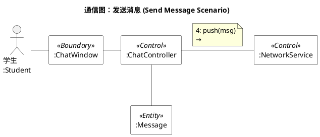
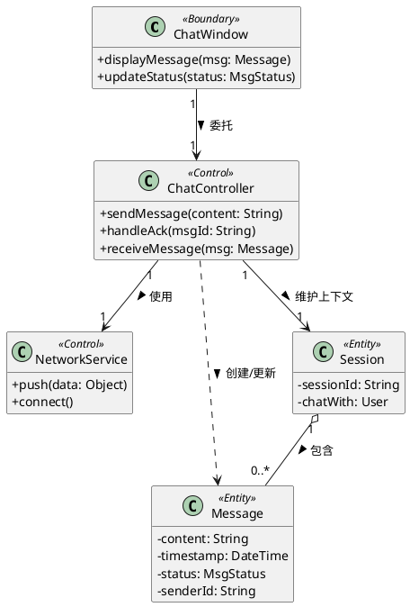
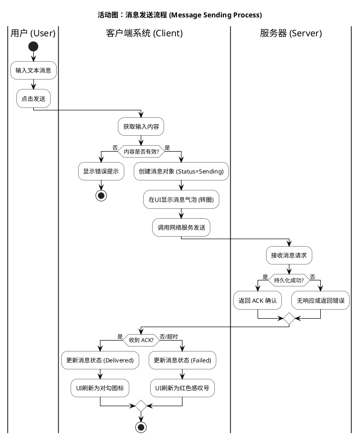
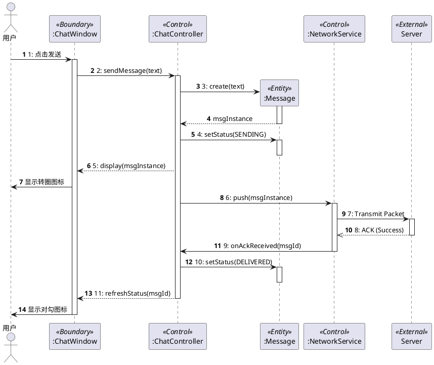
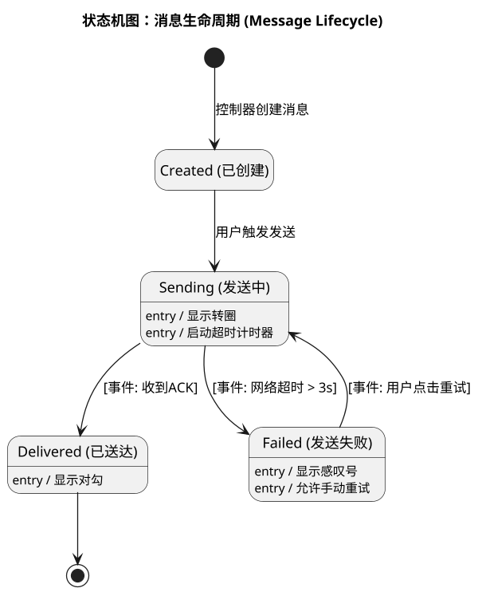
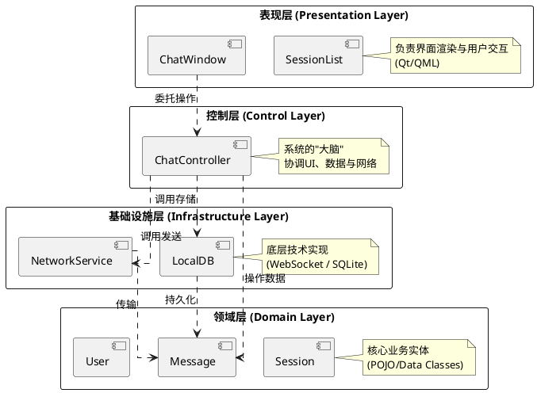
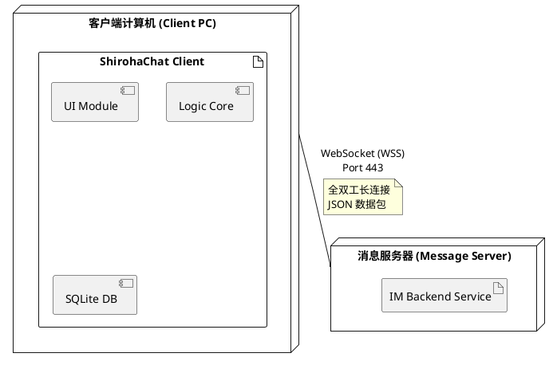

# ShirohaChat 项目文档

## 摘要

在人类沟通长期依赖书信等传统方式的阶段,信息传递的延迟与成本长期存在:跨地域沟通困难、往返周期长,在“等待回信”的过程中,关键信息往往滞后甚至错过最佳时点。手机普及与移动互联网兴起后,人们对“随时联系、即时回应”的需求迅速成为日常生活的刚需,即时通讯由此从工具性产品演进为社会连接的基础设施,以更低成本、更高频率支撑人与人之间更及时、更亲密的沟通。

在这一背景下,本项目拟开发一款面向大众的普适即时通讯工具——ShirohaChat(桌面端)。产品聚焦日常沟通场景,服务朋友、家人、异地恋与同学等社交关系维护需求,围绕“及时触达、顺畅表达、稳定可靠、隐私可控”四个方向构建核心体验,覆盖私聊/群聊、文本/图片/语音/表情与文件发送、离线消息与重连、已读未读与消息搜索等基础能力,满足大众用户对即时联系与低成本连接的长期需求。

在开发过程中,团队基于面向对象分析与设计方法(OOAD)和统一建模语言(UML)进行系统建模,采用客户端-服务器架构(C/S)实现消息实时传递。项目引入**非功能性需求(NFR)**管理、**协议契约设计**、**风险管理矩阵**与**量化性能指标**。系统实现端到端延迟 ≤ 200ms、消息送达率 ≥ 99.99%、单节点支持 ≥ 5000 并发连接,具备断线重连与离线补发机制,确保消息零丢失。

关键词:大众即时通讯,社交沟通,私聊,群聊,离线消息,消息可靠性,低延迟,NFR

---

## 修改历史

| 日期 | 版本 | 修改说明 | 作者 |
| --- | --- | ------- | --- |
|     |     |         |     |

---

## 目录

* 摘要
* 第1章 立项

  * 1.1 项目起源与提案
  * 1.2 Business Case
* 第2章 愿景

  * 2.1 问题陈述
  * 2.2 涉众与用户
  * 2.3 关键涉众和用户的需要
  * 2.4 产品概述
  * 2.5 产品特性
  * 2.6 其他产品需求
* 第3章 用况建模

  * 3.1 术语表
  * 3.2 主要用况
  * 3.3 用况的完整描述
* 第4章 需求分析
* 第5章 架构设计
* 第6章 详细设计
* 后记
* 参考文献

---

# 第1章 立项

## 1.1 项目起源与提案

### 项目背景

在书信等传统沟通方式主导的年代,信息传递延迟高、成本高,跨地域沟通尤为困难,人与人之间的联系往往被时间与距离切割。手机普及后,人们对“随时联系、即时回应”的需求迅速增长,即时通讯成为日常生活的基础设施:它不仅承担信息传递,也承载关系维护、情感表达与社交连接。

在大众沟通场景中,用户对即时通讯的核心期待并不复杂,但要求极高:要快、要稳、要省心、要可信。若基础体验存在短板,会直接放大沟通成本与情绪摩擦,主要体现在三类问题:

**1. 聊天入口多，重要信息难定位**
* 私聊与群聊同时进行,对话入口繁杂
* 约定时间、地址、转账说明等关键信息容易被刷屏淹没
* 回看成本高,错过信息后需要二次确认

**2. 表达与互动能力需要完整覆盖**
大众沟通不仅是“发文字”,还包括语音、图片、表情与文件等多模态表达,并需要引用、转发、撤回等高频互动能力,以降低误解与重复沟通。

**3. 弱网与离线场景下的可靠性与隐私诉求突出**
在网络波动、断线重连、设备切换等场景下,用户更关注“消息是否到达、是否重复、是否丢失”;同时,对隐私设置、黑名单与骚扰拦截也有明确预期。

### 项目定位

> **"一款面向大众的普适桌面端即时通讯工具,聚焦朋友与家人等日常社交关系维护,以低延迟、高可靠与隐私可控为基础,提供私聊/群聊与多媒体表达能力,满足随时联系、即时回应的沟通刚需。"**

### 核心价值主张

* **更及时**:降低“联系到对方”的等待成本,让沟通回到即时与自然的节奏
* **更亲密**:以语音、图片、表情等表达方式承载情绪与关系温度
* **更低成本**:让跨地域沟通与群体沟通不再受制于时间与费用
* **更可靠**:在弱网与断线情况下保持一致体验,尽量减少丢失与重复

## 1.2 Business Case

### 项目目标

开发一款**高性能、高可用**的普适即时通讯系统,采用MoSCoW方法进行功能优先级管理:

#### Must Have (MVP核心)
1. 账号体系(手机号/邮箱注册登录)
2. 联系人体系(添加/删除/备注/黑名单)
3. 私聊/群聊
4. 文本/图片/语音/表情消息
5. 文件发送(小文件)
6. Server-ACK机制
7. 离线消息拉取
8. 桌面客户端

#### Should Have
1. 搜索(按关键词/联系人/群组)
2. 已读/未读与未读计数
3. 置顶会话与消息引用回复
4. 消息撤回与转发

#### Could Have
1. 消息收藏
2. 群公告与群管理(入群方式、禁言、管理员)
3. 断网/弱网重连动画
4. 陌生人消息请求与反骚扰策略(开关、频控、举报)

#### Won't Have (本轮不做)
1. 视频/语音通话
2. 多端同步
3. 实时协作文档

### 预期收益

* **用户价值(大众用户)**:随时联系、即时回应,跨地域沟通成本显著降低,社交关系维护更自然、更稳定
* **用户价值(群体关系)**:群聊信息更清晰,重要信息更不易错过,降低重复确认与误解成本
* **技术价值**:提供零丢失、低延迟(≤200ms)、稳定可靠的实时通讯服务
* **学习价值**:完整展示IM系统的工业级架构设计,包含NFR管理、协议设计、可靠性机制与性能压测方法

### 约束与假设

| 维度   | 约束条件                              |
| ---- | --------------------------------- |
|      |                                   |


### 非功能性需求 (NFR)

| 维度   | 指标要求            | 验证方法              |
| ---- | --------------- | ----------------- |
|      |                 |                   |


---

# 第2章 愿景

## 2.1 问题陈述

### 问题一：即时联系成为刚需,基础体验要求更高

| 要素   | 描述                                                                  |
| ---- | ------------------------------------------------------------------- |
| 问题   | 手机普及后,“随时联系、即时回应”成为大众沟通的基本预期,但在弱网、断线、设备切换与高频群聊等场景下,消息到达与阅读状态不确定、重要信息易错过、回看与检索成本高等问题依然普遍存在。 |
| 影响群体 | 大众用户(朋友、家人、异地恋、同学等社交关系)、需要跨地域保持联系的人群。                                   |
| 后果   | 错过关键信息、反复确认造成沟通疲劳,并在高频互动中引发误解与情绪摩擦,抬高关系维护成本。          |
| 解决方案 | ShirohaChat 聚焦“及时触达与稳定可靠”:提供 Server-ACK、离线补发与断线重连,并配套清晰的未读计数、搜索与隐私/反骚扰设置,让沟通更省心。 |

### 问题二：现有方案的技术局限

| 要素   | 描述                                                 |
| ---- | -------------------------------------------------- |
| 问题   | 主流闭源 IM 系统难以进行架构研究与二次开发，开源方案多为 Demo 级别，缺乏工业级设计。 |
| 影响群体 | 软件工程学习者、系统架构研究者。                                   |
| 后果   | 理论与实践脱节，无法深入理解 WebSocket、消息可靠性、分布式状态管理等核心技术。    |
| 解决方案 | ShirohaChat 开源完整架构设计（含 NFR、协议、风险管理），可作为学习与扩展基础。   |

---

## 2.2 涉众与用户

### 1. 涉众分析

| 涉众类型  | 代表       | 核心诉求                           | 优先级  |
| ----- | -------- | ------------------------------ | ---- |
| 项目团队  | 开发组/测试组  | 掌握工业级 IM 架构设计与实现能力              | 高    |
| 目标用户  | 大众用户     | 稳定、易用的日常即时通讯工具                 | 高    |
| 技术评审者 | 导师/面试官   | 系统展示专业性（架构、性能、文档）              | 高    |
| 潜在扩展者 | 开源社区开发者  | 清晰的代码结构与接口文档                   | 中    |

### 2. 用户画像(典型大众场景)

#### 小周 - 异地恋用户

* **场景**:日常高频私聊,需要在不同时间与地点保持“随时联系、即时回应”
* **痛点**:
  - 弱网或断线时消息状态不明确,容易产生“是否收到”的焦虑
  - 夜间或工作时段需要更细粒度的通知与免打扰控制
  - 希望表达更自然(语音、图片、表情),但不希望操作复杂
* **期望**:消息到达更确定、通知可控、表达顺畅且操作简单

#### 阿慧 - 家庭群组织者

* **场景**:家庭群日常沟通与信息转达(聚餐时间、出行信息、照片分享等)
* **痛点**:
  - 群聊刷屏后重要信息容易被淹没,成员反复询问
  - 老人不熟悉复杂操作,需要更直观的未读与提示
  - 图片与文件较多时,回看与查找成本高
* **期望**:群聊信息更清晰、老人也能轻松使用、历史内容更好找

#### 小林 - 与陌生人沟通的用户

* **场景**:二手交易、兴趣社交等场景下与陌生人短期沟通
* **痛点**:
  - 易收到骚扰信息,需要明确的消息请求与拦截机制
  - 希望能快速建立联系,同时保护隐私
  - 沟通结束后希望一键清理并控制对方可见范围
* **期望**:更强的反骚扰与隐私设置、陌生人沟通更安全可控

---

## 2.3 关键涉众和用户的需要

| 涉众/用户 | 核心需求                            | 系统响应                        |
| ----- | ------------------------------- | --------------------------- |
| 大众用户  | 低延迟、消息可靠到达、离线补发、通知可控、隐私与反骚扰      | Server-ACK + 离线补发 + 未读计数/搜索 + 黑名单/消息请求  |
| 开发者   | 模块化架构、清晰接口文档、易于扩展               | API文档 + 分层设计 + 代码规范  |
| 评审者   | 展示系统专业性（性能指标、架构图、风险管理）          | NFR 量化 + 压测报告 + UML建模     |
| 运维者   | 一键部署、监控日志、故障恢复                  | 容器化部署 + 日志系统      |

---

## 2.4 产品概述

### 1. 产品定位陈述 (Elevator Pitch)

> **For** 大众用户(朋友、家人、异地恋、同学与陌生人沟通场景)  
> **Who** 在跨地域与高频社交沟通中需要“随时联系、即时回应”,并希望消息更可靠、通知更可控、隐私更安心  
> **The** ShirohaChat  
> **Is a** 面向大众的桌面端即时通讯工具  
> **That** 提供私聊/群聊、多媒体消息、未读与搜索、黑名单与消息请求等能力,并以 Server-ACK 与离线补发保证消息可靠送达  
> **Unlike** 微信(功能堆叠、入口复杂)、QQ(界面复杂、广告干扰)、Discord(国内访问难)  
> **Our product** 以“简洁、可靠、可控”为优先,同时保证消息可靠性≥99.99%、端到端延迟≤200ms,提供更聚焦的桌面端沟通体验

### 2. 完整的产品概述

ShirohaChat 是一款**面向大众的即时通讯系统(桌面端)**,采用前后端分离的 C/S 架构:

* **前端**:桌面客户端,提供联系人与会话列表,支持文本/图片/语音/表情与文件消息展示,并提供搜索与未读管理
* **后端**:实时通讯服务,实现Server-ACK、离线消息队列、在线状态与重连机制
* **数据层**:持久化存储用户/群组/消息数据,缓存在线状态与离线消息队列
* **核心特性**:
  - **日常沟通**:私聊/群聊、多媒体消息、引用回复与转发
  - **信息管理**:未读计数、消息搜索、置顶会话与收藏
  - **隐私与安全**:黑名单、陌生人消息请求、基础反骚扰策略
  - **消息可靠性**:Server-ACK机制、离线补发、消息零丢失(≥99.99%)
  - **高性能**:端到端延迟≤200ms,单节点支持≥5000并发连接

---

## 2.5 产品特性

| 优先级      | 功能模块             | 具体特性                             | 技术实现                    |
| -------- | ---------------- | -------------------------------- | ----------------------- |
|          |                  |                                  |                         |

---

## 2.6 其他产品需求
---

# 第3章 用况建模

## 3.1 术语表

| 术语 | 描述 |
| --- | --- |
| 用户（User） | 使用聊天系统的注册使用者 |
| 好友（Friend） | 与用户建立双向连接关系的其他用户 |
| 群聊（Group Chat） | 由多个用户组成的消息会话 |
| 消息（Message） | 文本、图片、文件或表情形式的数据 |
| Emoji | 图形表情符号，用于丰富聊天内容 |

---

## 3.2 ShirohaChat 的主要用况

---

## 3.3 主要用况的描述

### 3.3.1 即时通讯（聊天）

- **简要描述**：该用况描述用户选择会话、发送文本消息、查看实时反馈以及接收对方消息的完整交互过程。
- **用况图**：待补充。

**前置条件**

1. 用户已登录系统。
2. 用户的网络连接状态正常。
3. 用户的联系人列表中至少存在一个好友或群组。

**基本流（Basic Flow）**

{进入会话}  
1. 用户在主界面的会话列表中，选择一个联系人或群组进行点击。  
2. 系统打开该会话的聊天窗口，并显示之前的历史聊天记录。  

{编辑与发送}  
3. 用户在输入框中输入文本消息。  
4. 用户点击“发送”按钮（或按下回车键）。  
5. 系统对消息内容进行基本验证（如内容不为空）。  
6. 系统在聊天窗口中立即显示该条消息，并由系统显示“发送中”的状态标识。  
7. 系统在确认消息送达后，将消息状态更新为“已送达”标识。  

{接收消息}  
8. 系统在聊天窗口中实时显示对方发来的新消息。  
9. 系统自动滚动聊天视图以展示最新内容。  

**备选流 (Alternative Flows)**

- A1：收到来自其他会话的消息  
  1. 系统在左侧会话列表中，将新消息来源的会话置顶。  
  2. 系统在该会话项上显示未读消息提示（如红点或数字）。  
  3. 用户继续在当前窗口操作，不受干扰。  

- A2：查看历史消息  
  1. 用户向上滚动聊天窗口。  
  2. 系统加载并显示更早之前的聊天记录。  
  3. 用户停止滚动，用况恢复到当前步骤。  

**异常流 (Exception Flows)**

- E1：发送空消息  
  1. 系统检测到内容无效。  
  2. 系统保持发送按钮不可点击，或弹出提示“无法发送空内容”。  
  3. 用况回到基本流步骤 3。  

- E2：发送失败（网络异常）  
  1. 系统在超时或检测到断开后，将该消息的状态标识更新为“发送失败”（如红色感叹号）。  
  2. 用户点击该“失败标识”。  
  3. 系统尝试重新发送。  
     - E2a 重发成功：用况回到基本流步骤 7。  
     - E2b 重发失败：系统再次显示“失败标识”，等待用户下一次操作。  

**后置条件 (Post-conditions)**

- 成功：消息内容被系统存储，且界面显示“已送达”。  
- 失败：消息内容被本地保存（不丢失），界面显示“发送失败”。  

---

### 3.3.2 公共流（Common Flows）

#### UC-01：注册账户 (Register Account)

1. **简要描述**：该用况描述用户首次使用系统时，填写身份信息并创建新账户的全过程。  
2. **前置条件**：用户尚未拥有本系统账户；系统服务处于可用状态。  
3. **基本流**  
   1) 用户打开应用，点击“注册”按钮。  
   2) 系统显示注册界面，包含账号、密码、确认密码、昵称输入框。  
   3) 用户填写上述信息并提交。  
   4) 系统对输入内容进行格式校验（如长度、复杂度）。  
   5) 系统检查账号是否已被占用。  
   6) 系统确认创建新账户成功。  
   7) 系统提示“注册成功”。  
   8) 用户选择跳转至登录界面。  
4. **备选流 / 异常流**  
   - A1：账号已存在 → 系统提示“该账号已被注册”，并停留在注册界面。  
   - A2：密码不一致 → 系统提示“两次输入的密码不一致”。  
   - A3：输入不合规 → 系统提示具体的格式错误（如“密码需包含字母与数字”、“必填项不能为空”）。  
   - A5：服务不可用 → 系统提示“注册服务暂时不可用，请稍后重试”。  

#### UC-02：登录系统 (Login)

1. **简要描述**：该用况描述用户使用已有账户进入系统主界面的过程。  
2. **前置条件**：用户已完成注册；用户的网络连接正常。  
3. **基本流**  
   1) 用户启动应用进入登录界面。  
   2) 用户输入账号与密码并点击“登录”。  
   3) 系统检查输入格式是否有效。  
   4) 系统验证账号与密码的正确性。  
   5) 系统验证通过，开始初始化用户数据。  
   6) 系统建立与聊天服务器的连接。  
   7) 系统跳转到主界面，显示会话列表。  

---

# 第4章 需求分析

## 4.1 健壮性分析 (Robustness Analysis)

健壮性分析通过区分三类对象（边界、控制、实体）来验证用况逻辑的完整性。针对本次迭代的核心用况 UC-01 即时通讯，我们识别出以下关键分析类：

### 4.1.1 识别分析类

1. **边界对象 (Boundary Objects)**
   - 职责：系统与外部参与者交互的接口。
   - ChatWindow (聊天窗口)：显示消息列表、接收用户输入、展示发送状态（转圈/对勾）。
   - SessionList (会话列表)：显示好友/群组列表及未读红点。

2. **控制对象 (Control Objects)**
   - 职责：协调业务逻辑，连接边界与实体。
   - ChatController (聊天控制器)：核心调度者。负责验证消息、创建消息实体、调用网络服务、更新 UI 状态。
   - NetworkService (网络服务)：负责底层通信（发送数据包、监听接收）。

3. **实体对象 (Entity Objects)**
   - 职责：存储系统需要长久保存的数据。
   - Message (消息)：包含内容、发送者、时间戳、状态（Sending/Delivered/Failed）。
   - User (用户)：包含用户 ID、昵称、头像。
   - Session (会话)：维护当前聊天的上下文（是跟谁聊）。

## 4.2 交互建模：通信图

根据 UML 2.2 第9章，通信图强调对象之间的链接关系。这对于发现类图中的"关联"至关重要。
我们选取 UC-01 的基本流（发送消息）进行建模。

### 4.2.1 发送消息通信图



### 4.2.2 通信图分析与链接识别

通过通信图，我们明确了对象在空间上的结构关系（即"谁认识谁"）：

1. UI 与 控制器：ChatWindow 向 ChatController 发送了消息（2: sendMessage），说明窗口必须持有控制器的引用，以便触发业务逻辑。
2. 控制器 与 实体：ChatController 创建并操作 Message（3: create），说明控制器管理着消息实体的生命周期。
3. 控制器 与 网络：ChatController 调用 NetworkService（4: push），说明业务逻辑层依赖于基础设施层来执行发送任务。

### 4.2.3 从通信图导出分析类图

根据通信图中识别出的链接 (Links) 和消息 (Messages)，我们可以直接转化为类图中的关联 (Associations) 和操作 (Operations)。

- **链接 -> 关联**：通信图中两个对象之间有连线，类图中这两个类之间就有关联关系。
- **消息 -> 方法**：对象 A 向 对象 B 发送消息 doSomething()，则 类 B 中必须定义方法 doSomething()



### 4.2.4 类职责说明

- **ChatWindow**: 负责界面的渲染。它不包含业务逻辑，只负责将用户的点击转发给 ChatController。
- **ChatController**: 系统的核心。它隔离了界面和网络，确保界面不知道网络是如何实现的（符合黑盒原则）。它持有 NetworkService 的句柄来发送数据。
- **Message**: 纯数据类（Data Object）。包含第一次迭代所需的属性，如 content (内容) 和 status (用于UI显示转圈或对勾)。

## 4.3 交互建模

### 4.3.1 活动图

**图 4-3 发送消息活动图** - 该图展示了消息从用户输入到最终状态更新的完整业务逻辑流



**活动图说明**：

- **泳道 (Swimlanes)**：将活动划分为"用户"、"客户端系统"、"服务器"三个责任区，明确了职责边界。
- **决策节点 (Decision Nodes)**：图中包含两个关键判断：
  1. 前置校验：在发送前拦截非法内容（空消息）。
  2. 后置确认：根据是否收到 ACK 决定消息最终状态，这是保证数据一致性的逻辑核心。

### 4.3.2 顺序图

**图 4-4 消息发送与ACK机制顺序图** - 该图依据 UML 2.2 规范，展示了边界对象、控制对象与实体对象之间的时间序列交互。



**顺序图说明**：

- **生命线 (Lifelines)**：清晰列出了参与交互的所有对象。
- **激活条 (Activation Bars)**：细长的矩形表示对象处于活动（处理）状态的时间段。
- **消息类型**：
  - 同步消息（实心箭头）：如 sendMessage()，表示调用后等待返回。
  - 异步消息（开箭头）：如 ACK 回执，表示网络层的异步通知。
- **对象创建**：消息 3 (create) 展示了 Message 实体是在发送过程中被动态创建的。

### 4.3.3 状态机图

**图 4-5 消息实体状态机图** - 根据项目"高可靠性"的需求，Message 对象不仅是数据容器，还是一个具有复杂生命周期的状态机。



**状态机图说明**：

- **状态 (States)**：
  - Sending：中间瞬态。进入此状态时（entry action）会启动超时计时器。
  - Delivered：最终成功状态。
  - Failed：异常状态。此状态允许转换回 Sending 状态（即重发机制）。
- **转换 (Transitions)**：
  - [事件: 网络超时 > 3s]：这是一个监护条件 (Guard Condition)，定义了从发送中变为失败的触发逻辑。
  - Failed --> Sending：这个闭环路径完美解释了需求中的"重试机制"。

## 4.4 需求分析小结

通过本章的分析工作，我们完成了从外部需求到内部逻辑的映射：

1. 健壮性分析 - 识别了 ChatController 和 Message 等关键类。
2. 通信图 - 确定了这些类之间的静态链接关系。
3. 活动图 - 梳理了业务逻辑的分支判断。
4. 顺序图 - 验证了对象协作的时序正确性。
5. 状态机图 - 确保了核心对象生命周期的完整性。

---

# 第5章 架构设计

本章在需求分析模型的基础上，定义 ShirohaChat 的高层系统架构。我们采用 C/S（客户端-服务器）架构结合分层模式 (Layered Pattern)，以满足"端到端延迟 ≤ 200ms"和"消息零丢失"的非功能性需求。

## 5.1 逻辑架构设计 (Logical Architecture)

为了实现"高内聚、低耦合"，我们将系统划分为四个逻辑层。这种分层设计确保了 UI 的变更不会影响核心业务逻辑，且网络协议的替换不会破坏数据模型。

### 5.1.1 逻辑分层包图 (Package Diagram)

我们将类划分为：表现层、控制层、领域层和基础设施层。



### 5.1.2 各层职责说明

1. **表现层 (Presentation)**：
   - 包含 ChatWindow 等边界类。
   - 职责：仅负责显示数据（如消息气泡、红点）和捕获用户输入。严禁包含复杂的业务判断逻辑。

2. **控制层 (Control)**：
   - 包含 ChatController。
   - 职责：应用的核心枢纽。它接收 UI 的请求，验证数据，决定是先存库还是先发送，并控制 UI 的状态流转（如从"发送中"变更为"已送达"）。

3. **领域层 (Domain)**：
   - 包含 Message, User 实体。
   - 职责：定义数据的结构和纯粹的业务规则（如"消息不能为空"）。它不依赖任何 UI 或网络库，是最稳定的部分。

4. **基础设施层 (Infrastructure)**：
   - 包含 NetworkService 和 LocalDB。
   - 职责：封装具体的技术实现。例如，如果未来将 WebSocket 换成 TCP Socket，只需修改此层，上层业务无需变动。

## 5.2 物理部署架构

### 5.2.1 部署说明

- **客户端**：运行在用户 PC 上的富客户端程序，内嵌 SQLite 数据库用于离线存储历史记录。
- **通信协议**：使用 WebSocket 协议建立全双工长连接，确保服务器能主动推送新消息（即时性保障）。



## 5.3 并发与线程设计 (Concurrency Design)

为了保证 UI 响应流畅度（< 50ms），必须将耗时操作从主线程剥离。我们采用"主线程 + 工作线程"模型。

1. **UI 主线程 (Main Thread)**：
   - 职责：仅负责界面绘制、动画渲染和响应鼠标点击。
   - 约束：严禁执行任何阻塞操作（如网络 IO、大文件读写），否则会导致界面"假死"。

2. **网络工作线程 (Network Worker)**：
   - 职责：维护 WebSocket 连接的心跳，序列化/反序列化 JSON 数据。
   - 交互：收到消息后，通过信号/槽 (Signal/Slot) 机制或回调函数，将数据安全地传递给 UI 线程进行显示。

3. **IO 工作线程 (DB Worker)**：
   - 职责：执行 SQLite 的 insert/query 操作。
   - 策略：采用异步写入队列，防止磁盘 IO 阻塞消息发送流程。

## 5.4 关键设计模式 (Design Patterns)

根据教材第12章，我们在架构中应用以下模式以解决特定问题：

### 5.4.1 观察者模式 (Observer Pattern)

- **问题**：当收到新消息时，如何通知聊天窗口、会话列表、任务栏同时更新，且不造成强耦合？
- **方案**：ChatController 作为主题 (Subject)，UI 组件作为观察者 (Observer)。当 Controller 收到消息时，广播事件，所有订阅的 UI 自动刷新。

### 5.4.2 单例模式 (Singleton Pattern)

- **问题**：系统中只能有一个网络连接实例和一个数据库连接实例。
- **方案**：将 NetworkService 和 ChatController 设计为单例，确保全局访问点唯一，避免资源冲突。

## 5.5 数据持久化策略 (Persistence Strategy)

为了满足"消息零丢失"的需求，架构上采用 Write-Ahead (预写) 策略：

**1. 发送时**：
- 用户点击发送 → 立即写入本地 DB (状态: Sending) → 再发起网络请求。
- 目的：即使网络请求瞬间程序崩溃，重启后也能从本地 DB 恢复该消息并重试。

**2. 接收时**：
- 收到网络包 → 立即写入本地 DB → 再通知 UI 显示。
- 目的：保证用户看到的每一条消息都已落地存储，支持离线查看历史记录。

---

# 第6章 详细设计

本章基于第4章需求分析识别的分析类和第5章架构设计的分层模型，针对C++20面向对象设计 + QML前端技术栈，进行类级别的详细设计。

## 6.1 技术栈说明

### 6.1.1 核心技术选型

- **后端/核心**：C++20 + Qt 6.x
  - 采用面向对象设计（OOAD）
  - 使用现代C++特性（智能指针、移动语义、RAII）
  - Qt框架用于网络、线程、数据库支持

- **前端**：QML + Qt Quick
  - 声明式UI描述
  - MVVM架构模式
  - C++与QML通过Qt元对象系统交互

### 6.1.2 模块边界

根据第5章架构设计的分层模式，模块职责划分如下：

| 层次 | 实现语言 | 职责 | 关键类 |
|------|----------|------|--------|
| 表现层 | QML | UI渲染、用户交互 | ChatWindow.qml, SessionList.qml |
| 控制层 | C++ | 业务逻辑协调 | ChatController |
| 领域层 | C++ | 核心实体与规则 | Message, User, Session |
| 基础设施层 | C++ | 技术基础设施 | NetworkService, LocalDB |

---

## 6.2 核心类详细设计（C++）

本节基于第4章4.2.3节分析类图，对每个类进行详细设计。

### 6.2.1 领域层实体类

#### 类：Message（消息实体）

**设计依据**：第4章4.1.1节实体对象定义 + 第4.3.3节状态机图

**类定义**：

```cpp
// message.h
#pragma once
#include <QString>
#include <QDateTime>
#include <memory>

namespace ShirohaChat {

enum class MessageStatus {
    Sending,    // 发送中（中间瞬态）
    Delivered,  // 已送达（收到Server-ACK）
    Failed      // 发送失败（超时或网络异常）
};

class Message {
public:
    // 构造函数：依据第4章通信图"3: create(txt, status=Sending)"
    explicit Message(const QString& content,
                    const QString& senderId,
                    const QString& sessionId);

    // 移动语义支持（C++11/14优化）
    Message(Message&&) noexcept = default;
    Message& operator=(Message&&) noexcept = default;

    // 禁止拷贝（消息对象唯一性）
    Message(const Message&) = delete;
    Message& operator=(const Message&) = delete;

    ~Message() = default;

    // Getter（依据第4章4.2.3节类图属性）
    QString msgId() const { return m_msgId; }
    QString content() const { return m_content; }
    QString senderId() const { return m_senderId; }
    QString sessionId() const { return m_sessionId; }
    QDateTime timestamp() const { return m_timestamp; }
    MessageStatus status() const { return m_status; }

    // Setter：状态转换（依据第4.3.3节状态机图）
    void setStatus(MessageStatus newStatus);

private:
    QString m_msgId;        // UUID（客户端生成）
    QString m_content;      // 消息内容
    QString m_senderId;     // 发送者ID
    QString m_sessionId;    // 所属会话ID
    QDateTime m_timestamp;  // 创建时间戳
    MessageStatus m_status; // 当前状态
};

using MessagePtr = std::unique_ptr<Message>;

} // namespace ShirohaChat
```

**状态转换约束**（依据第4.3.3节状态机图）：

```text
Sending --[收到ACK]--> Delivered （成功状态）
Sending --[超时>3s]--> Failed    （失败状态）
Failed --[用户重试]--> Sending   （允许重新发送）
```

**对象生命周期管理**：
- 使用 `std::unique_ptr<Message>` 表达唯一所有权
- ChatController 负责创建和管理 Message 对象
- 通过移动语义避免不必要的拷贝

---

#### 类：Session（会话实体）

**设计依据**：第4章4.1.1节实体对象定义 + 第4章4.2.3节类图

**类定义**：

```cpp
// session.h
#pragma once
#include <QString>
#include "user.h"

namespace ShirohaChat {

class Session {
public:
    explicit Session(const QString& sessionId, const User& chatWith);
    ~Session() = default;

    QString sessionId() const { return m_sessionId; }
    const User& chatWith() const { return m_chatWith; }

private:
    QString m_sessionId;
    User m_chatWith;  // 聊天对象（私聊场景）
    // 注：群聊场景需要扩展为 QList<User>，但当前文档未明确，标记为缺口
};

} // namespace ShirohaChat
```

**信息缺口标注**：
- [ ] **待确认**：群聊场景下 Session 如何表示多个参与者？
- [ ] **待确认**：Session 是否需要维护未读计数？（第2章需求提到，但未在分析类中体现）

---

#### 类：User（用户实体）

**设计依据**：第4章4.1.1节实体对象定义

**类定义**：

```cpp
// user.h
#pragma once
#include <QString>

namespace ShirohaChat {

class User {
public:
    explicit User(const QString& userId,
                 const QString& nickname);
    ~User() = default;

    QString userId() const { return m_userId; }
    QString nickname() const { return m_nickname; }

    // 待扩展：头像、在线状态（文档第4章提到但未详细建模）

private:
    QString m_userId;
    QString m_nickname;
    // QString m_avatarUrl;   // 缺口：未在分析类中明确
    // OnlineStatus m_status; // 缺口：未在分析类中明确
};

} // namespace ShirohaChat
```

---

### 6.2.2 控制层

#### 类：ChatController（聊天控制器）

**设计依据**：
- 第4章4.1.1节控制对象定义
- 第4章4.2节通信图（方法：sendMessage, handleAck, receiveMessage）
- 第4章4.3.2节顺序图
- 第5章5.4.2节单例模式

**类定义**：

```cpp
// chat_controller.h
#pragma once
#include <QObject>
#include <QString>
#include <QMap>
#include <memory>
#include "message.h"
#include "session.h"
#include "network_service.h"

namespace ShirohaChat {

class ChatController : public QObject {
    Q_OBJECT
    Q_PROPERTY(Session* currentSession READ currentSession NOTIFY currentSessionChanged)

public:
    // 单例模式（依据第5章5.4.2节）
    static ChatController& instance();

    // 禁止拷贝和移动
    ChatController(const ChatController&) = delete;
    ChatController& operator=(const ChatController&) = delete;

    Session* currentSession() const { return m_currentSession.get(); }

    // 核心方法（依据第4章通信图和顺序图）
    Q_INVOKABLE void sendMessage(const QString& content);  // 对应通信图"2: sendMessage(txt)"
    void onAckReceived(const QString& msgId);              // 对应通信图"5: onAckReceived()"
    void onMessageReceived(const QString& rawData);        // 接收服务器推送的新消息

signals:
    // 观察者模式信号（依据第5章5.4.1节）
    void messageStatusChanged(const QString& msgId, MessageStatus newStatus);
    void newMessageArrived(const Message& msg);
    void currentSessionChanged();

private:
    explicit ChatController(QObject* parent = nullptr);
    ~ChatController() override = default;

    // 依赖注入（依据第4章类图关联关系）
    NetworkService& m_networkService;

    // 状态维护
    std::unique_ptr<Session> m_currentSession;              // 当前会话上下文
    QMap<QString, MessagePtr> m_pendingMessages;            // 待确认消息队列（msgId -> Message）

    // 内部辅助方法
    void startAckTimer(const QString& msgId);               // 启动ACK超时计时器（第4章状态机图）
    void handleSendFailure(const QString& msgId);           // 处理发送失败
};

} // namespace ShirohaChat
```

**方法职责说明**：

##### sendMessage(const QString& content)

**依据**：第4章4.3.2节顺序图"发送消息"流程

**前置条件**：
- 用户已登录
- currentSession 不为空

**执行逻辑**（Write-Ahead策略，依据第5章5.5节）：

```text
1. 创建 Message 对象（status = Sending）
2. 【关键】立即写入本地数据库（防止进程崩溃）
3. 调用 m_networkService.push(message)
4. 将消息加入 m_pendingMessages 队列
5. 启动 ACK 超时计时器（3秒）
6. emit messageStatusChanged() 通知UI
```

**异常安全**：
- 使用 RAII 确保数据库事务完整性
- 网络发送失败不影响本地存储

##### onAckReceived(const QString& msgId)

**依据**：第4章4.2节通信图"5: onAckReceived()"

**执行逻辑**：

```text
1. 从 m_pendingMessages 中移除消息
2. 取消对应的超时计时器
3. 更新数据库中该消息的状态为 Delivered
4. emit messageStatusChanged(msgId, Delivered)
```

**线程安全**：此方法由网络工作线程回调触发，需确保线程安全（使用Qt信号槽的队列连接）

---

#### 类：NetworkService（网络服务）

**设计依据**：
- 第4章4.1.1节控制对象定义
- 第4章4.2节通信图（方法：push, connect）
- 第5章5.3节并发设计

**类定义**：

```cpp
// network_service.h
#pragma once
#include <QObject>
#include <QString>
#include <QWebSocket>
#include <memory>

namespace ShirohaChat {

class NetworkService : public QObject {
    Q_OBJECT

public:
    static NetworkService& instance();

    // 禁止拷贝和移动
    NetworkService(const NetworkService&) = delete;
    NetworkService& operator=(const NetworkService&) = delete;

    // 核心方法（依据第4章通信图）
    void connect(const QString& serverUrl);  // 对应"connect()"
    void push(const Message& msg);           // 对应"4: push(msg)"

signals:
    void ackReceived(const QString& msgId);
    void messageArrived(const QString& rawData);
    void connectionLost();

private:
    explicit NetworkService(QObject* parent = nullptr);
    ~NetworkService() override = default;

    // WebSocket连接（运行在独立的网络工作线程，依据第5章5.3节）
    std::unique_ptr<QWebSocket> m_webSocket;

    // 心跳维护
    void sendHeartbeat();  // 周期性发送心跳包

    // 重连策略（指数退避，依据第1章NFR需求）
    void attemptReconnect();
};

} // namespace ShirohaChat
```

**线程模型**（依据第5章5.3节）：
- NetworkService 对象创建在主线程，但WebSocket运行在独立的网络工作线程
- 使用Qt的信号槽机制实现线程间通信（自动队列连接）
- 避免在网络线程中直接操作UI或数据库

**信息缺口标注**：
- [ ] **待确认**：WebSocket数据包的具体格式（JSON? Protobuf?）
- [ ] **待确认**：心跳间隔时长（文档未明确）
- [ ] **待确认**：重连策略的具体参数（最大重试次数、退避系数）

---

### 6.2.3 基础设施层

#### 类：LocalDB（本地数据库）

**设计依据**：第5章5.5节数据持久化策略

**类定义**：

```cpp
// local_db.h
#pragma once
#include <QObject>
#include <QString>
#include <QSqlDatabase>
#include "message.h"

namespace ShirohaChat {

class LocalDB : public QObject {
    Q_OBJECT

public:
    static LocalDB& instance();

    // 禁止拷贝和移动
    LocalDB(const LocalDB&) = delete;
    LocalDB& operator=(const LocalDB&) = delete;

    // 数据库操作（在IO工作线程执行，依据第5章5.3节）
    bool insertMessage(const Message& msg);
    bool updateMessageStatus(const QString& msgId, MessageStatus status);
    QList<Message> queryMessagesBySession(const QString& sessionId, int limit, int offset);

private:
    explicit LocalDB(QObject* parent = nullptr);
    ~LocalDB() override = default;

    QSqlDatabase m_db;

    // 异步写入队列（防止阻塞主线程）
    void processWriteQueue();
};

} // namespace ShirohaChat
```

**并发控制**（依据第5章5.3节）：
- 数据库操作必须在IO工作线程执行
- 使用`QThreadPool`或专用`QThread`管理IO线程
- 写操作通过队列异步化，避免阻塞

**信息缺口标注**：
- [ ] **待确认**：数据库表结构设计（messages表、sessions表、users表的字段定义）
- [ ] **待确认**：索引策略（查询性能优化）
- [ ] **待确认**：数据库文件路径和版本管理策略

---

## 6.3 QML前端设计

### 6.3.1 MVVM架构模式

根据第5章分层架构，QML层作为View，通过Qt元对象系统与C++ ViewModel交互。

**架构图**：

```text
┌─────────────────────────────────────┐
│        QML View (表现层)             │
│  ┌─────────────┐  ┌───────────────┐ │
│  │ ChatWindow  │  │ SessionList   │ │
│  │   .qml      │  │   .qml        │ │
│  └─────────────┘  └───────────────┘ │
└─────────┬────────────────┬──────────┘
          │ Property       │
          │ Binding        │
          │ Signal/Slot    │
┌─────────▼────────────────▼──────────┐
│     C++ ViewModel/Controller        │
│       (ChatController)              │
│    暴露为 QML Context Property       │
└─────────────────────────────────────┘
```

---

### 6.3.2 QML组件设计

#### ChatWindow.qml（聊天窗口）

**设计依据**：第4章4.1.1节边界对象"ChatWindow"

**组件职责**：
- 显示消息列表（MessageList）
- 接收用户输入（TextField）
- 响应发送按钮点击

**QML代码骨架**：

```qml
// ChatWindow.qml
import QtQuick 
import QtQuick.Controls 

Item {
    id: root

    // 从 C++ ChatController 绑定当前会话
    property var currentSession: chatController.currentSession

    Column {
        anchors.fill: parent

        // 消息列表视图
        ListView {
            id: messageListView
            model: messageModel  // C++ QAbstractListModel
            delegate: MessageBubble {
                messageText: model.content
                status: model.status  // Sending/Delivered/Failed
            }
        }

        // 输入框
        TextField {
            id: inputField
            placeholderText: "输入消息..."
        }

        // 发送按钮
        Button {
            text: "发送"
            onClicked: {
                // 调用 C++ ChatController 的方法（依据第4章通信图）
                chatController.sendMessage(inputField.text)
                inputField.clear()
            }
        }
    }

    // 监听消息状态变更信号（观察者模式，依据第5章5.4.1节）
    Connections {
        target: chatController
        function onMessageStatusChanged(msgId, newStatus) {
            // 更新对应消息的显示状态（转圈 → 对勾 或 红色感叹号）
            messageModel.updateStatus(msgId, newStatus)
        }
    }
}
```

**C++与QML交互方式**：

1. **Context Property注册**（在main.cpp中）：

```cpp
// main.cpp
#include <QQmlApplicationEngine>
#include <QQmlContext>
#include "chat_controller.h"

int main(int argc, char *argv[]) {
    QGuiApplication app(argc, argv);
    QQmlApplicationEngine engine;

    // 将 ChatController 单例暴露给 QML
    engine.rootContext()->setContextProperty(
        "chatController",
        &ChatController::instance()
    );

    engine.load(QUrl(QStringLiteral("qrc:/ChatWindow.qml")));
    return app.exec();
}
```

2. **QAbstractListModel for MessageList**：

```cpp
// message_list_model.h
class MessageListModel : public QAbstractListModel {
    Q_OBJECT
public:
    enum Roles {
        ContentRole = Qt::UserRole + 1,
        StatusRole,
        TimestampRole
    };

    int rowCount(const QModelIndex& parent = QModelIndex()) const override;
    QVariant data(const QModelIndex& index, int role) const override;
    QHash<int, QByteArray> roleNames() const override;

    Q_INVOKABLE void updateStatus(const QString& msgId, MessageStatus status);

private:
    QList<Message> m_messages;
};
```

---

#### SessionList.qml（会话列表）

**设计依据**：第4章4.1.1节边界对象"SessionList"

**组件职责**：
- 显示所有会话（好友/群组）
- 显示未读红点
- 响应会话点击切换

**QML代码骨架**：

```qml
// SessionList.qml
import QtQuick 
import QtQuick.Controls 

ListView {
    id: sessionListView
    model: sessionModel  // C++ QAbstractListModel

    delegate: Rectangle {
        width: parent.width
        height: 60

        Row {
            Text { text: model.nickname }
            Text { text: model.lastMessage }

            // 未读红点（依据第2章产品需求）
            Rectangle {
                visible: model.unreadCount > 0
                color: "red"
                radius: 10
                Text {
                    text: model.unreadCount
                    color: "white"
                }
            }
        }

        MouseArea {
            anchors.fill: parent
            onClicked: {
                // 切换会话（需要在 C++ ChatController 中实现）
                chatController.switchSession(model.sessionId)
            }
        }
    }
}
```

**信息缺口标注**：
- [ ] **待确认**：会话列表的排序规则（按时间？按置顶？）
- [ ] **待确认**：未读计数的更新机制（何时清零？）

---

## 6.4 对象协作与序列设计

基于第4章4.3.2节顺序图，详细说明关键用况的对象交互。

### 6.4.1 发送消息完整流程

**依据**：第4章顺序图"消息发送与ACK机制"

**C++实现伪代码**：

```cpp
// chat_controller.cpp
void ChatController::sendMessage(const QString& content) {
    // 前置校验
    if (content.isEmpty() || !m_currentSession) {
        return;  // 或抛出异常
    }

    // 1. 创建消息实体（依据通信图"3: create"）
    auto msg = std::make_unique<Message>(
        content,
        getCurrentUserId(),
        m_currentSession->sessionId()
    );
    const QString msgId = msg->msgId();

    // 2. Write-Ahead：立即写入本地数据库（依据第5章5.5节）
    LocalDB::instance().insertMessage(*msg);

    // 3. 发送网络包（依据通信图"4: push"）
    m_networkService.push(*msg);

    // 4. 加入待确认队列
    m_pendingMessages.insert(msgId, std::move(msg));

    // 5. 启动超时计时器（3秒，依据第4章状态机图）
    startAckTimer(msgId);

    // 6. 通知UI更新（观察者模式）
    emit messageStatusChanged(msgId, MessageStatus::Sending);
}

void ChatController::onAckReceived(const QString& msgId) {
    auto it = m_pendingMessages.find(msgId);
    if (it != m_pendingMessages.end()) {
        // 取消超时计时器
        cancelAckTimer(msgId);

        // 更新状态为 Delivered
        (*it)->setStatus(MessageStatus::Delivered);
        LocalDB::instance().updateMessageStatus(msgId, MessageStatus::Delivered);

        // 通知UI
        emit messageStatusChanged(msgId, MessageStatus::Delivered);

        // 移除待确认队列
        m_pendingMessages.erase(it);
    }
}
```

**异常处理**：
- 数据库写入失败：记录日志，消息仍保留在内存中等待重试
- 网络发送失败：由 NetworkService 触发 `connectionLost()` 信号
- ACK超时：由定时器触发 `handleSendFailure()`

---

## 6.5 并发与线程安全设计

**依据**：第5章5.3节并发与线程设计

### 6.5.1 线程模型实现

```cpp
// main.cpp 或 application.cpp
void setupThreading() {
    // 1. UI 主线程：Qt主事件循环，运行QML界面
    //    → 自动由 QGuiApplication 管理

    // 2. 网络工作线程：WebSocket 连接
    QThread* networkThread = new QThread();
    NetworkService::instance().moveToThread(networkThread);
    networkThread->start();

    // 3. IO 工作线程：数据库操作
    QThread* ioThread = new QThread();
    LocalDB::instance().moveToThread(ioThread);
    ioThread->start();
}
```

**线程间通信**：
- 使用Qt信号槽的**队列连接**（Queued Connection）确保线程安全
- 禁止跨线程直接调用方法（除非使用互斥锁保护）

### 6.5.2 智能指针与所有权管理

```cpp
// 所有权规则：
// 1. Message 对象由 ChatController 唯一拥有（unique_ptr）
// 2. 传递给网络层或数据库层时，使用 const引用（不转移所有权）
// 3. 从数据库查询返回时，使用 shared_ptr（多个组件可能引用历史消息）

void ChatController::sendMessage(const QString& content) {
    auto msg = std::make_unique<Message>(...);  // 唯一所有权

    LocalDB::instance().insertMessage(*msg);    // 传递引用，不转移所有权
    m_networkService.push(*msg);                // 传递引用

    m_pendingMessages.insert(msg->msgId(), std::move(msg));  // 转移所有权
}
```

---

## 6.6 关键设计决策与缺口清单

### 6.6.1 已确定的设计决策

1. **单例模式适用范围**（依据第5章5.4.2节）：
   - ChatController：全局唯一，管理应用状态
   - NetworkService：全局唯一，维护单一WebSocket连接
   - LocalDB：全局唯一，避免数据库连接冲突

2. **观察者模式实现**（依据第5章5.4.1节）：
   - 使用Qt信号槽机制天然支持观察者模式
   - ChatController 发射信号，QML 组件通过 Connections 订阅

3. **Write-Ahead策略**（依据第5章5.5节）：
   - 消息先写数据库，再发网络
   - 确保进程崩溃时消息不丢失

### 6.6.2 信息缺口与待确认清单

**高优先级缺口**：
- [ ] **协议设计**：WebSocket数据包的JSON格式定义（字段、类型、示例）
- [ ] **数据库Schema**：messages/sessions/users 表的完整字段定义和索引策略
- [ ] **NFR量化**：ACK超时阈值（当前假设3秒）、心跳间隔、重连策略参数

**中优先级缺口**：
- [ ] **群聊支持**：Session 如何表示多人会话？Message 如何关联到群？
- [ ] **消息类型扩展**：图片/语音/文件消息的存储和传输方式（当前仅支持文本）
- [ ] **离线消息**：用户上线后如何拉取离线消息？（第1章提到但未建模）

**低优先级缺口**：
- [ ] **已读/未读**：消息已读状态的服务端同步机制
- [ ] **搜索功能**：全文搜索的实现方式（数据库FTS? 独立索引?）
- [ ] **黑名单/陌生人消息请求**：具体的业务逻辑和UI交互流程

---

# 后记


---

# 参考文献

