# ShirohaChat 项目文档

## 摘要

本项目旨在开发一款面向校园协作场景的即时通讯系统——ShirohaChat。项目采用WebSocket + Redis + MySQL,融合现代化 Web 技术与实时通信架构,提供注册登录、好友管理、单聊与群聊、可靠消息传输、离线消息补发、文件传输、表情互动等核心功能,致力于构建一个**高性能、高可用、易扩展**的即时通信平台。

在开发过程中,团队基于面向对象分析与设计方法(OOAD)和统一建模语言(UML)进行系统建模,采用客户端-服务器架构(C/S)实现消息实时传递。项目引入**非功能性需求(NFR)**管理、**协议契约设计**、**风险管理矩阵**与**量化性能指标**,在技术架构、可靠性保障和用户体验方面均达到专业水准。系统实现端到端延迟 ≤ 200ms、消息送达率 ≥ 99.99%、单节点支持 ≥ 5000 并发连接,具备断线重连与离线补发机制,确保消息零丢失。

关键词:即时通讯,WebSocket,Redis,消息可靠性,NFR,性能优化,校园协作IM

---

## 日期 / 修改 / 描述 / 作者

---

## 目录

* 摘要
* 第1章 立项

  * 1.1 项目起源与提案
  * 1.2 Business Case
* 第2章 愿景

  * 2.1 问题陈述
  * 2.2 涉众与用户
  * 2.3 关键涉众和用户的需要
  * 2.4 产品概述
  * 2.5 产品特性
  * 2.6 其他产品需求
* 第3章 用况建模

  * 3.1 术语表
  * 3.2 主要用况
  * 3.3 用况的完整描述
* 第4章 需求分析
* 第5章 架构设计
* 第6章 详细设计
* 后记
* 参考文献

---

# 第1章 立项

## 1.1 项目起源与提案

### 项目背景

随着互联网通信的迅速发展，即时通讯软件已成为现代协作的核心工具。然而，现有主流应用在**校园场景**存在明显痛点：

* **微信**：传输代码格式混乱、文件易丢失、群聊消息难追溯
* **QQ**：界面复杂、广告干扰、资源占用高
* **Discord**：登录繁琐、对国内网络环境不友好

### 项目定位

> **"面向校园协作的轻量级即时通讯系统，解决小组作业沟通低效、文件传输不稳定的痛点。"**

### 技术创新点

本项目采用**工业级技术架构**，通过完整的软件工程流程（需求分析、架构设计、NFR管理、风险控制）实现：

1. **WebSocket 长连接** + **Socket.io** 实现实时双向通信
2. **Redis 状态管理**实现在线状态与消息路由
3. **MySQL 持久化**保障消息可靠存储
4. **Server-ACK 机制**确保消息送达确认
5. **离线消息补发**支持断线重连后自动拉取

## 1.2 Business Case

### 项目目标

开发一款**高性能、高可用**的即时通讯系统，核心功能包括：

* **Must Have (MVP 核心)**：注册登录、私聊、Server-ACK、离线拉取最近 N 条消息
* **Should Have**：群聊、在线状态显示、消息搜索
* **Could Have**：文件上传、表情包、AI 消息摘要
* **Won't Have (后续迭代)**：语音视频通话

### 预期收益

* **用户价值**：提供零丢失、低延迟（≤200ms）、稳定可靠的实时通讯服务
* **技术价值**：掌握 WebSocket、Redis、分布式系统设计等工业级技术栈
* **展示价值**：构建可量化、可演示的专业级项目作品

### 约束与假设

| 维度   | 约束条件                              |
| ---- | --------------------------------- |
| 技术栈  | Node.js + Socket.io + Redis + MySQL |
| 部署   | Docker Compose 一键部署              |
| 性能   | 单节点支持 ≥5000 并发连接                  |
| 可用性  | 99.9% 在线率                         |
| 安全   | 全链路 TLS + bcrypt 密码加密            |
| 前端   | Vue/React + Ant Design           |

### 非功能性需求 (NFR)

| 维度   | 指标要求            | 验证方法              |
| ---- | --------------- | ----------------- |
| 性能   | 端到端延迟 ≤ 200ms   | time diff log     |
| 并发   | 单节点 ≥5000 连接    | autocannon 压测     |
| 可靠性  | 消息送达率 ≥99.99%   | 丢包模拟测试            |
| 恢复性  | 断线重连时间 ≤2s      | 自动重连统计            |
| 可维护性 | 模块化接口 + 日志体系    | Swagger 接口文档      |
| 安全性  | bcrypt 加盐 + TLS | 渗透测试 + OWASP TOP10 |

---

# 第2章 愿景

> 本章明确产品定位、目标用户、核心痛点及解决方案，为后续架构设计提供业务依据。

## 2.1 问题陈述

### 问题一：校园协作场景的即时通讯痛点

| 要素   | 描述                                                                  |
| ---- | ------------------------------------------------------------------- |
| 问题   | 现有聊天工具在校园小组协作场景存在**代码格式丢失、文件传输不稳定、消息难追溯**等痛点。                   |
| 影响群体 | 高校学生、开发学习者、小型团队协作用户。                                              |
| 后果   | 导致协作效率低下、重要文件丢失、代码沟通困难，影响项目进度与学习体验。                               |
| 解决方案 | ShirohaChat 提供**专为协作优化的消息传输机制**，确保消息零丢失、文件稳定传输、代码格式保留。            |

### 问题二：现有方案的技术局限

| 要素   | 描述                                                 |
| ---- | -------------------------------------------------- |
| 问题   | 主流闭源 IM 系统难以进行架构研究与二次开发，开源方案多为 Demo 级别，缺乏工业级设计。 |
| 影响群体 | 软件工程学习者、系统架构研究者。                                   |
| 后果   | 理论与实践脱节，无法深入理解 WebSocket、消息可靠性、分布式状态管理等核心技术。    |
| 解决方案 | ShirohaChat 开源完整架构设计（含 NFR、协议、风险管理），可作为学习与扩展基础。   |

---

## 2.2 涉众与用户

### 1. 涉众分析

| 涉众类型  | 代表       | 核心诉求                           | 优先级  |
| ----- | -------- | ------------------------------ | ---- |
| 项目团队  | 开发组/测试组  | 掌握工业级 IM 架构设计与实现能力              | 高    |
| 目标用户  | 高校学生     | 稳定、易用的协作沟通工具                   | 高    |
| 技术评审者 | 导师/面试官   | 系统展示专业性（架构、性能、文档）              | 高    |
| 潜在扩展者 | 开源社区开发者  | 清晰的代码结构与接口文档                   | 中    |

### 2. 用户画像

#### 张三 - 计算机专业学生

* **场景**：小组作业需要频繁讨论代码与传输文档
* **痛点**：微信发代码格式乱、QQ 传文件经常过期
* **期望**：消息可靠、支持代码高亮、文件永久保存

#### 李四 - 开源项目爱好者

* **场景**：参与多个开源项目，需要稳定的沟通工具
* **痛点**：Discord 国内访问不稳定、Slack 收费贵
* **期望**：自托管、低成本、高可用

---

## 2.3 关键涉众和用户的需要

| 涉众/用户 | 核心需求                            | 系统响应                        |
| ----- | ------------------------------- | --------------------------- |
| 学生用户  | 消息零丢失、文件稳定传输、代码格式保留             | Server-ACK + 离线补发 + 富文本支持  |
| 开发者   | 模块化架构、清晰接口文档、易于扩展               | Swagger 文档 + 分层设计 + Git规范  |
| 评审者   | 展示系统专业性（性能指标、架构图、风险管理）          | NFR 量化 + 压测报告 + UML建模     |
| 运维者   | 一键部署、监控日志、故障恢复                  | Docker Compose + 日志系统      |

---

## 2.4 产品概述

### 1. 产品定位陈述 (Elevator Pitch)

> **For** 高校学生与小型团队  
> **Who** 需要稳定、轻量、可靠的协作沟通工具  
> **The** ShirohaChat  
> **Is a** 基于 WebSocket + Redis 的即时通讯系统  
> **That** 提供消息零丢失、端到端延迟≤200ms、支持离线补发的实时聊天服务  
> **Unlike** 微信（文件易丢失）、Discord（国内访问难）  
> **Our product** 保证消息可靠性 ≥99.99%，支持自托管与二次开发

### 2. 完整的产品概述

ShirohaChat 是一款**面向校园协作场景的即时通讯系统**，采用前后端分离的 C/S 架构：

* **前端**：基于 Vue/React + Ant Design，提供流畅的用户界面与实时交互体验
* **后端**：基于 Node.js + Socket.io + Express，实现 WebSocket 长连接、消息路由与状态管理
* **数据层**：MySQL 负责消息持久化，Redis 负责在线状态与会话缓存
* **核心特性**：Server-ACK 机制、断线重连、离线消息补发、群聊广播、文件传输

**技术亮点**：

1. 采用 Socket.io 内置的心跳与重连机制，简化连接管理
2. Redis 存储 `userId → socketId` 映射，实现毫秒级消息路由
3. Server-ACK 模式（而非端到端 ACK），降低复杂度同时保证可靠性
4. 重连后自动拉取最近 50 条未读消息，确保消息连续性

---

## 2.5 产品特性

| 优先级      | 功能模块             | 具体特性                             | 技术实现                    |
| -------- | ---------------- | -------------------------------- | ----------------------- |
| **Must** | 用户认证             | 注册、登录、JWT 令牌                    | bcrypt 加密 + Redis 会话   |
| **Must** | 私聊消息             | 文本、表情、状态（已发/已达）                 | WebSocket + Server-ACK  |
| **Must** | 消息可靠性            | 离线补发、重连恢复                        | MySQL 持久化 + 序列号去重      |
| Should   | 群聊               | 多人消息广播、成员管理                      | Redis Pub/Sub           |
| Should   | 在线状态             | 实时显示在线/离线/输入中                    | Redis Set + 心跳检测        |
| Should   | 消息搜索             | 关键词检索历史记录                        | MySQL 全文索引             |
| Could    | 文件传输             | 图片/文档上传下载                        | OSS 对象存储 + 缩略图         |
| Could    | AI 功能            | 消息摘要、智能回复                        | 调用 GPT API             |
| Won't    | 音视频通话            | 实时语音/视频（后续迭代）                    | WebRTC (V2.0)           |

---

## 2.6 其他产品需求

### 2.6.1 性能需求 (Performance)

| 指标       | 目标值       | 测试方法                         |
| -------- | --------- | ---------------------------- |
| 消息端到端延迟  | ≤ 200ms   | 客户端打时间戳 + 服务器响应时间差           |
| 并发连接数    | ≥ 5000    | autocannon 模拟 5000 WebSocket |
| 消息吞吐量    | ≥ 10000/s | Redis 队列压测                   |
| 离线消息拉取延迟 | ≤ 100ms   | SQL 查询最近 50 条消息耗时            |

### 2.6.2 可靠性需求 (Reliability)

| 指标     | 目标值      | 实现方式                  |
| ------ | -------- | --------------------- |
| 消息送达率  | ≥ 99.99% | Server-ACK + 重试机制（最多3次） |
| 系统可用性  | 99.9%    | 健康检查 + 自动重启            |
| 断线重连时间 | ≤ 2s     | Socket.io 自动重连        |

### 2.6.3 兼容性需求 (Compatibility)

* **浏览器支持**：Chrome 90+、Firefox 88+、Safari 14+
* **操作系统**：Windows 10+、macOS 11+、Ubuntu 20.04+
* **移动端**（可选）：响应式设计支持移动浏览器

### 2.6.4 安全性需求 (Security)

| 威胁类型  | 防护措施                    |
| ----- | ----------------------- |
| 密码泄露  | bcrypt 加盐（salt rounds=10） |
| 中间人攻击 | 全链路 TLS 1.3             |
| SQL注入 | 参数化查询（Prepared Statement） |
| XSS攻击 | 前端输入过滤 + CSP 策略         |

### 2.6.5 可维护性需求 (Maintainability)

* **代码规范**：ESLint + Prettier
* **接口文档**：Swagger 自动生成
* **日志系统**：Winston 分级日志（debug/info/error）
* **监控告警**：Prometheus + Grafana（可选）

### 2.6.6 可扩展性需求 (Scalability)

* **水平扩展**：支持多节点部署 + Nginx 负载均衡
* **消息队列**：预留 RabbitMQ 接口用于削峰
* **存储扩展**：支持 MySQL 主从复制 + 读写分离

---

# 第3章 用况建模

> 重要说明：本文档结构非标准，请按需调整。

请确定系统所有用况，写出简要描述，并选择一个用况进行完整描述。

## 3.1 术语表

| 术语             | 描述               |
| -------------- | ---------------- |
| 用户（User）       | 使用聊天系统的注册使用者     |
| 好友（Friend）     | 与用户建立双向连接关系的其他用户 |
| 群聊（Group Chat） | 多个用户组成的消息会话      |
| 消息（Message）    | 文本、图片、文件、表情数据    |
| Emoji          | 图形表情符号           |

---

## 3.2 ShirohaChat 的主要用况

1. 注册账户
2. 登录系统
3. 添加好友
4. 删除好友
5. 发起私人聊天
6. 参与群聊
7. 发送图片 / 文件 / 表情
8. 查看聊天记录
9. 修改个人资料（昵称、头像）
10. 加入群聊
11. 创建群聊
12. 退出群聊
13. 退出系统

---

## 3.3 主要用况的完整描述

---

### （1）注册账户

#### 1.1 简要描述

该用况描述用户首次使用系统时，填写个人信息以创建新账户的过程。

#### 1.2 用况图

（占位）

#### 1.3 前置条件

用户尚未在系统中注册账户。

#### 1.4 基本流

1. 用户在登录界面选择“注册”。
2. 系统显示注册界面，要求输入用户名、密码、确认密码及其他信息。
3. 用户填写后点击“注册”。
4. 系统检查合法性（重复、密码长度等）。
5. 合法 → 写入数据库。
6. 系统提示“注册成功”，返回登录界面。

#### 1.5 备选流

* A1：用户名已存在 → 提示
* A2：两次密码不一致 → 提示

---

### （2）登录系统

#### 1.1 简要描述

该用况描述用户通过输入账号与密码登录系统的过程。

#### 1.2 用况图
（占位）

#### 1.3 前置条件

用户已成功注册并存在账户记录。

#### 1.4 基本流
用户已成功注册并存在账户记录。

1. 用户启动 ShirohaChat 客户端。
2. 系统显示登录界面。
3. 用户输入用户名与密码。
4. 系统验证账户信息。
5. 若验证成功，系统加载用户信息、好友列表、历史记录。
6. 系统进入主界面。

#### 1.5 备选流

* A1：用户名或密码错误 → 提示
* A2：服务器连接失败 → 提示

---

### （3）添加好友

#### 1.1 简要描述

描述用户通过搜索并添加好友的流程。

#### 1.2 用况图
（占位）

#### 1.3 前置条件

用户已登录系统。

#### 1.4 基本流
1. 用户选择“添加好友”。
2. 系统显示搜索框，用户输入用户名/账号。
3. 系统查询数据库。
4. 若存在 → 显示头像与昵称。
5. 用户点击“添加”。
6. 系统发送好友申请。
7. 对方收到申请。
8. 对方同意后，双方建立好友关系。
9. 系统提示“添加成功”。

#### 1.5 备选流

* A1：搜索无结果
* A2：对方拒绝

---
### （4）删除好友

#### 1.6 简要描述

描述用户删除好友的过程。

#### 1.7 用况图
（占位）

#### 1.8 前置条件

用户已登录且存在好友关系。

#### 1.9 基本流
1. 用户在好友列表右键某好友。
2. 系统显示操作菜单，选择“删除好友”。
3. 系统弹出确认框。
4. 用户点击“确认”。
5. 系统删除双方好友关系记录。
6. 系统提示“删除成功”。

#### 1.10 备选流
* A1：点击“取消” → 返回列表

---

### （5）发起私人聊天

#### 1.1 简要描述

描述用户与好友进行一对一聊天的流程。

#### 1.2 用况图
（占位）

#### 1.3 前置条件

用户已登录且至少有一位好友。

#### 1.4 基本流
1. 用户点击某位好友。
2. 系统打开聊天窗口。
3. 用户输入消息。
4. 点击发送。
5. 系统通过 TCP 发送消息至服务器。
6. 服务器转发至目标客户端。
7. 对方客户端显示消息、播放提示音。
8. 系统写入聊天记录数据库。

#### 1.5 备选流

* A1：网络中断 → 消息发送失败

---

### （6）参与群聊

#### 1.1 简要描述
描述用户在群组中聊天的流程。

#### 1.2 用况图

（占位）

#### 1.3 前置条件
用户已加入至少一个群聊。

#### 1.4 基本流

1. 用户选择某个群聊。
2. 系统加载群成员与历史记录。
3. 用户输入文字/选择文件。
4. 点击发送。
5. 系统通过服务器广播消息。
6. 所有成员接收消息。

#### 1.5 备选流
* A1：若用户已被移出群聊 → 提示

---

### （7）发送图片 / 文件 / 表情

#### 1.6 简要描述

描述发送非文本内容的流程。

#### 1.7 用况图

#### 1.8 前置条件

用户已进入聊天界面。

#### 1.9 基本流
1. 用户点击“+ / 附件”。
2. 系统打开文件选择器。
3. 用户选择文件/图片。
4. 系统显示预览。
5. 用户确认发送。
6. 系统通过多线程传输模块发送文件。
7. 服务器转发至接收方。
8. 接收方提示并保存文件。

#### 1.10 备选流

* A1：文件过大
* A2：网络异常

---

### （8）查看聊天记录

#### 1.1 简要描述

描述查看历史消息的流程。

#### 1.2 用况图

#### 1.3 前置条件

用户已登录且存在历史记录。

#### 1.4 基本流
1. 用户选择“查看记录”。
2. 系统从数据库加载对应记录。
3. 按时间顺序显示。
4. 用户可滚动或搜索关键词。

#### 1.5 备选流

* A1：无历史记录 → 提示

---

### （9）修改个人资料（昵称、头像）

#### 1.1 简要描述
描述用户修改资料的流程。

#### 1.2 用况图

#### 1.3 前置条件

用户已登录。

#### 1.4 基本流
1. 用户点击“个人信息 / 设置”。
2. 系统显示资料（昵称、头像等）。
3. 用户点击“编辑资料”。
4. 可修改昵称或头像。
5. 修改昵称 → 输入并保存。
6. 修改头像 → 文件选择窗口。
7. 系统预览头像并提示确认。
8. 用户确认后写入数据库并同步服务器。
9. 提示“修改成功”。

#### 1.5 备选流

* A1：取消编辑 → 返回
* A2：上传头像格式不符 → 提示
* A3：网络中断 → 修改失败

---

### （10）加入群聊

#### 1.1 简要描述

用户通过群号、邀请链接或好友邀请加入群聊。

#### 1.2 用况图

#### 1.3 前置条件

用户已登录。

#### 1.4 基本流
1. 用户选择“加入群聊”。
2. 系统显示三种方式：群号、邀请链接、邀请消息。
3. 用户输入群聊信息。
4. 系统验证群聊存在与权限。
5. 通过后用户加入群成员表。
6. 系统提示“加群成功”。

#### 1.5 备选流
* A1：群号不存在
* A2：需要审核

---

### （11）创建群聊

#### 1.1 简要描述

描述用户创建群聊的过程。

#### 1.2 用况图
（占位）

#### 1.3 前置条件

用户已登录且至少有一位好友。

#### 1.4 基本流
1. 用户点击“创建群聊”。
2. 系统显示创建界面，要求输入名称/描述。
3. 系统显示好友列表，用户选择邀请对象。
4. 用户点击“完成创建”。
5. 系统验证输入合法性。
6. 数据库创建群聊记录并设用户为群主。
7. 系统向好友发送邀请。
8. 系统提示“群聊创建成功”。

#### 1.5 备选流

* A1：群聊名称为空
* A2：未选择任何好友
* A3：取消创建

---

### （12）退出群聊
#### 1.1 简要描述

描述用户退出群聊流程。

#### 1.2 用况图

#### 1.3 前置条件
用户已加入至少一个群聊。

#### 1.4 基本流

1. 用户选择某个群聊。
2. 进入群聊信息界面。
3. 点击“退出群聊”。
4. 系统弹出确认框。
5. 用户确认退出。
6. 系统移除用户群关系。
7. 提示“已退出群聊”。

#### 1.5 备选流

* A1：取消 → 返回

---

### （13）退出系统

#### 1.1 简要描述

描述用户退出系统流程。

#### 1.2 用况图

（占位）

#### 1.3 前置条件

用户已登录。

#### 1.4 基本流

1. 用户点击“退出”。
2. 系统弹出确认框。
3. 用户确认。
4. 系统保存状态与未发送消息。
5. 断开服务器连接并关闭窗口。

#### 1.5 备选流
* A1：取消 → 返回主界面

---

# 第4章 需求分析

## 4.1 健壮性分析

### 4.1.1 健壮性（Robustness）分析方法

本节采用 ICONIX 风格的健壮性分析方法，从 **Boundary（边界对象）/ Control（控制对象）/ Entity（实体对象）** 三个层次出发，对基于 WebSocket 的校园协作 IM 系统进行健壮性建模。分析目标如下：

- 从蓝图中自动提取核心用例，识别其输入输出边界、服务控制流程以及持久化实体。
- 针对每个用例系统性识别异常场景与边界情况（网络波动、服务不可用、数据异常、重复请求等）。
- 为每类异常设计工程化的系统处理策略（输入校验、重试、幂等、降级、补偿）与用户反馈方式。
- 在健壮性图中显式标注 Boundary / Control / Entity 对象，映射到蓝图中的 Electron 客户端、WebSocket 网关、IM 核心服务、文件服务、Redis、MySQL、对象存储等组件。

### 4.1.2 核心用例

结合 MoSCoW 功能规划、协作链路模型、系统架构与 Demo Flow，本系统的健壮性分析聚焦以下核心用例：

1. **用户登录（学号/邮箱登录 Electron 桌面端）**  
   - 来源：蓝图「功能规划 - Must Have：账号体系（学号/邮箱注册登录）」与「演示脚本：学生登录」。
2. **课程群/小组群发送文本/代码消息（WebSocket + Server-ACK）**  
   - 来源：蓝图「私聊/群聊（课程群/小组群）」「文本消息、代码消息（Markdown）」「WebSocket 消息格式」「Server-ACK」。
3. **在线接收并展示消息**  
   - 来源：蓝图「协作链路：讨论决策」「WebSocket 网关 + IM 核心服务 + Redis 状态」「端到端延迟 ≤ 200ms」。
4. **离线消息拉取与补发（断线重连后最近 N 条）**  
   - 来源：蓝图「Must Have：离线消息拉取」「断网重连时间 ≤ 2s」「Demo Flow：打断网络 → 自动重连 → 消息补发」。
5. **文件上传与群内共享（小文件 + 群文件列表）**  
   - 来源：蓝图「文件传输（小文件）」「文件系统架构（元数据 + 对象存储）」「群文件列表（自动聚合）」。
6. **消息搜索与历史查看**  
   - 来源：蓝图「Should Have：搜索」「message 表 FULLTEXT 索引」「协作链路：文档产出与提交」。
7. **调用 AI 会话摘要服务**  
   - 来源：蓝图「Could Have：AI 会话总结服务（Node/C++ 双实现）」「多语言后端可演进 + gRPC 接口」。
8. **断网/弱网重连与连接状态管理**  
   - 来源：蓝图「心跳检测 + 断线重连」「断网/弱网重连动画」「断网重连时间 ≤ 2s」「消息送达率 ≥ 99.99%」。

后续健壮性（Robustness）分析表和健壮性图均围绕上述核心用例展开。

### 4.1.3 健壮性分析表

#### 用例：用户登录（学号/邮箱登录）

| 用例 | 异常场景编号 | 异常描述 | 可能原因 | 影响 | 系统处理策略（校验/重试/幂等/降级） | 用户反馈 |
| --- | --- | --- | --- | --- | --- | --- |
| 用户登录 | L-01 | 学号/邮箱格式不合法 | 用户误输入、前端未校验或绕过校验 | 无法发起有效认证请求 | Electron 客户端与服务层在发送前进行格式校验，非法请求直接在边界层拒绝，不访问 IM 核心/DB | 在登录页字段下方提示「账号格式错误，请检查学号/邮箱」 |
| 用户登录 | L-02 | 用户名或密码错误 | 用户输入错误，或数据库中无对应用户记录 | 用户无法登录系统 | IM 核心服务统一返回认证失败结果，不泄露具体原因，记录结构化日志 | 登录页提示「账号或密码错误」，支持有限次数重试 |
| 用户登录 | L-03 | 登录接口服务不可用/超时 | 服务层或 IM 核心进程异常、重启中、网络抖动 | 登录请求长时间无响应 | 客户端设置合理超时时间（如 3–5s），失败后退避重试；服务层通过健康检查与监控告警 | 登录页展示「服务器暂时不可用，请稍后重试」并保留已填表单 |
| 用户登录 | L-04 | 登录成功但 WebSocket 长连接建立失败 | 网关端口不可达、TLS 握手失败、代理限制 | 无法进入实时会话，消息无法收发 | 登录 REST 成功后继续建立 WebSocket，若握手失败则回滚在线状态（Redis）、标记用户为离线 | 弹出提示「实时连接失败，将重试连接」，展示重连动画 |

#### 用例：发送文本/代码消息（课程群/小组群）

| 用例 | 异常场景编号 | 异常描述 | 可能原因 | 影响 | 系统处理策略（校验/重试/幂等/降级） | 用户反馈 |
| --- | --- | --- | --- | --- | --- | --- |
| 发送消息 | S-01 | 用户在断线状态点击发送 | WebSocket 已断开或正在重连 | 消息无法立刻送达，可能丢失 | Boundary 侧检测连接状态，若未连接则将消息缓存在本地发送队列，等待连接恢复后按 `seq` 顺序发送 | 聊天窗口内将消息标记为「等待发送」，并显示连接状态提示 |
| 发送消息 | S-02 | Server-ACK 超时未返回 | 网关/IM 核心负载过高，网络抖动，服务异常 | 用户端不确定消息是否送达，可能重复发送 | 使用 `seq` 字段做幂等键，客户端在 ACK 超时后有限次重发；IM 核心按 `seq + sessionId + fromId` 幂等写入，去重持久化 | 当发生重试时，对用户提示「网络波动，正在重试发送」，最终给出成功或失败结果 |
| 发送消息 | S-03 | 消息体过大或 Markdown 结构异常 | 用户粘贴大量代码/文档，或内容格式错误 | 消息转发失败或影响其他用户体验 | 网关对消息大小做上限校验，大于阈值拒收；IM 核心对 Markdown 进行安全过滤；支持将超大内容转为文件上传引导 | 提示「消息过长，请以文件形式发送」或「内容格式不支持」 |
| 发送消息 | S-04 | 用户在短时间内高频发送消息 | 滥用/脚本攻击/误操作 | 影响系统性能，可能导致延迟抖动 | 网关按 userId + 会话维度设定限流阈值，触发后直接丢弃或延迟处理，同时写指标与告警 | 在聊天窗口提示「发送过于频繁，请稍后再试」 |

#### 用例：在线接收并展示消息

| 用例 | 异常场景编号 | 异常描述 | 可能原因 | 影响 | 系统处理策略（校验/重试/幂等/降级） | 用户反馈 |
| --- | --- | --- | --- | --- | --- | --- |
| 接收消息 | R-01 | 消息顺序错乱 | 网络抖动、不同分片路径、推送重试 | 会话时间线混乱，影响理解 | IM 核心按 `sessionId + created_at` 排序写库，客户端按 `seq`/时间戳重新排序展示；对极端异常落入「加载更多」 | UI 只显示已排序后的消息，底部提供「还有历史消息，向上滚动查看」 |
| 接收消息 | R-02 | 收到重复消息 | 网关重试、客户端重连时重复推送 | 聊天窗口出现重复内容 | 客户端以 `seq` 或 `msgId` 去重，只保留首次展示；IM 核心也在推送侧做去重缓存 | 用户侧不感知重复，只看到一次消息 |
| 接收消息 | R-03 | 消息解析失败（协议格式错误） | 客户端版本不匹配、payload 缺失字段 | 单条消息无法显示或导致崩溃风险 | 在客户端解析层做健壮性判断，对异常消息做「安全降级」：以占位提示代替，不影响整体连接；记录结构化日志 | 在消息位置显示「暂不支持显示该消息内容」，不阻断其他消息 |
| 接收消息 | R-04 | 目标会话不存在或用户无权限 | 用户被移出课程群/小组群 | 无法查看对应消息 | IM 核心在推送前做权限校验，若无权限则不推送并记录审计日志 | 若用户仍停留在该会话，顶部显示「你已不再属于该群组」并引导返回课程列表 |

#### 用例：离线消息拉取与补发

| 用例 | 异常场景编号 | 异常描述 | 可能原因 | 影响 | 系统处理策略（校验/重试/幂等/降级） | 用户反馈 |
| --- | --- | --- | --- | --- | --- | --- |
| 离线拉取 | O-01 | 离线期间消息量过大 | 用户长时间离线，活跃群消息爆发 | 一次拉取数据量过大，影响性能 | IM 核心按「最近 N 条」与时间窗口分页返回，客户端按需分页加载；可限制单次补发数量 | 在会话顶部展示「已为你加载最近 N 条消息」，支持继续上拉加载更早记录 |
| 离线拉取 | O-02 | Redis 离线队列丢失/过期 | Redis 故障或重启未持久化 | 部分离线消息无法通过队列恢复 | 降级从 MySQL `message` 表按 `sessionId + created_at` 扫描差异，尽可能补全；同时对 Redis 故障打告警 | 用户可能只感知为「历史消息未完全加载」，提供「查看更多历史记录」入口 |
| 离线拉取 | O-03 | 重连成功但离线拉取超时 | 服务端压力大或网络延迟 | 补发过程缓慢，影响体验 | 对离线拉取设置独立超时时间与重试，超过阈值只返回部分结果，并提示用户可手动刷新 | 在页面顶部提示「历史消息加载较慢，可稍后下拉刷新」 |
| 离线拉取 | O-04 | 客户端本地时间与服务器时间偏差大 | 设备时间不准 | 按时间增量拉取可能丢/重消息 | 拉取接口以服务端时间与 `msgId` 为准，不依赖本地时间；客户端仅作为展示 | 用户无感知，内部保证不因本地时间导致丢消息 |

#### 用例：文件上传与群内共享

| 用例 | 异常场景编号 | 异常描述 | 可能原因 | 影响 | 系统处理策略（校验/重试/幂等/降级） | 用户反馈 |
| --- | --- | --- | --- | --- | --- | --- |
| 文件上传 | F-01 | 文件超出大小限制或类型不支持 | 用户选择超大文件或可执行文件等 | 服务器资源被占用或存在安全风险 | 客户端与文件服务双侧校验大小/类型，不符合策略则拒绝上传；记录安全日志 | 在文件选择结果处提示「文件过大或类型不支持」 |
| 文件上传 | F-02 | 上传过程中网络中断 | 弱网或断网 | 上传失败或部分分片丢失 | 文件服务支持分片/断点续传；客户端检测失败后可在网络恢复时自动重试或允许用户手动重试 | 在进度条位置提示「网络中断，上传已暂停」，恢复后提示「可重试上传」 |
| 文件上传 | F-03 | 对象存储写入成功但 MySQL 元数据写入失败 | DB 容量/连接异常 | 文件已存在但前端不可见 | 文件服务对写元数据失败的记录入重试队列，定时补偿写入；若持续失败可标记为「孤儿文件」用于后续清理 | 对用户提示「文件记录保存失败，请稍后刷新群文件列表」，避免误以为数据完全丢失 |
| 文件上传 | F-04 | 群文件列表聚合失败 | 群文件列表查询超时或索引异常 | 群文件视图为空或不完整 | 在群文件列表查询时设置超时与降级路径：超时则仅展示最近上传的若干文件，或提供「点击刷新」 | 在群文件页提示「文件列表加载失败，可点击重试」 |

#### 用例：消息搜索与历史查看

| 用例 | 异常场景编号 | 异常描述 | 可能原因 | 影响 | 系统处理策略（校验/重试/幂等/降级） | 用户反馈 |
| --- | --- | --- | --- | --- | --- | --- |
| 搜索与历史 | H-01 | FULLTEXT 索引未创建或失效 | 初始化脚本遗漏、表结构变更 | 搜索结果不完整或查询变慢 | 启动时检查索引存在性；在可观测性中监控查询耗时，发现异常后触发索引重建脚本 | 用户侧只感知为搜索变慢或结果不全，可提示「搜索结果可能不完整」 |
| 搜索与历史 | H-02 | 搜索请求超时或返回过多结果 | 查询条件过宽、消息数据量巨大 | 前端无响应或卡顿 | 服务端为搜索设置分页与最大返回条数，必要时返回 Top N 并建议用户缩小范围 | 在搜索结果页提示「结果过多，请增加关键字或筛选条件」 |
| 搜索与历史 | H-03 | 用户无访问某课程群/小组群权限 | 权限变更、退课/退群 | 搜索结果包含用户不应访问的数据风险 | 搜索时按 userId + 会话权限过滤，仅返回用户当前可访问的会话消息 | 若用户从旧链接进入无权限会话，顶部提示「你已失去该会话访问权限」 |
| 搜索与历史 | H-04 | 搜索服务对 DB 产生高负载 | 高并发搜索、索引设计不当 | 影响在线消息写入/读取性能 | 对搜索接口进行限流与隔离，必要时提供只读副本库承载搜索流量 | 搜索结果页提示「搜索功能繁忙，可稍后再试」 |

#### 用例：AI 会话摘要生成

| 用例 | 异常场景编号 | 异常描述 | 可能原因 | 影响 | 系统处理策略（校验/重试/幂等/降级） | 用户反馈 |
| --- | --- | --- | --- | --- | --- | --- |
| 会话摘要 | A-01 | Node/C++ 摘要服务不可用 | 进程崩溃、升级中、网络故障 | 无法生成摘要，但核心 IM 不受影响 | 通过服务层健康检查检测不可用时自动降级：隐藏入口或标记摘要功能临时关闭，不影响消息收发 | 在会话摘要入口处提示「摘要服务暂时不可用，不影响聊天功能」 |
| 会话摘要 | A-02 | 摘要请求超时 | 上下文过长或算法计算慢 | 用户等待时间过长 | 设置合理超时时间与后台异步任务模式：超时则终止本次生成，允许用户稍后重试 | UI 显示「生成时间较长，已取消本次请求」或「请缩短选择的消息范围重试」 |
| 会话摘要 | A-03 | 摘要服务返回格式错误或内容为空 | 版本不兼容、实现缺陷 | 客户端解析失败或展示异常 | 在服务层对返回内容做 JSON 结构校验，不合法则丢弃并记录日志，不推给前端 | 用户看到「暂未生成有效摘要」，而不是报错堆栈 |
| 会话摘要 | A-04 | 频繁调用导致扩展服务过载 | 用户多次重复点击或自动触发 | 影响摘要服务与其他后端资源 | 对摘要接口按用户与会话维度限流，超过阈值直接拒绝并返回友好错误 | 提示「摘要生成过于频繁，请稍后再试」 |

#### 用例：断网/弱网重连与连接状态管理

| 用例 | 异常场景编号 | 异常描述 | 可能原因 | 影响 | 系统处理策略（校验/重试/幂等/降级） | 用户反馈 |
| --- | --- | --- | --- | --- | --- | --- |
| 连接管理 | C-01 | 心跳超时但实际网络可用 | 客户端短暂卡顿或 GC、后台休眠 | 误判为断线，触发重连 | 通过多次心跳失败阈值才判定断线，并与 OS 网络状态结合；重连采用指数退避 | 用户看到短暂「正在重连」动画，但不影响最终使用 |
| 连接管理 | C-02 | 网络抖动导致频繁断开/重连 | 校园 Wi-Fi 不稳定 | 频繁重建连接，浪费资源，影响体验 | 网关与客户端协同，通过重连间隔控制和最大重试次数限制抖动；超过阈值进入「休眠」状态 | 在 UI 中提供清晰的连接状态条，提示「网络不稳定」并允许用户手动重试 |
| 连接管理 | C-03 | 客户端多次重连失败 | 网关或 IM 核心服务中断 | 用户长时间无法使用系统 | 客户端在多次重试失败后停止自动重连，切换为静态错误页；服务端通过监控和告警尽快恢复 | 页面显示「无法连接到服务器，请检查网络或稍后再试」 |
| 连接管理 | C-04 | 重连成功但状态恢复不完整 | Redis 状态与客户端本地状态不一致 | 在线状态与会话列表异常 | 重连成功后强制进行一次「会话列表 + 未读计数 + 离线消息」全量同步，作为状态自检 | 页面短暂展示「正在同步数据」进度，完成后恢复正常使用 |

### 4.1.4 健壮性图

以下健壮性图均采用 Mermaid 表示，按照 ICONIX 模式区分 Boundary / Control / Entity 对象。

#### 用例：用户登录（学号/邮箱登录）

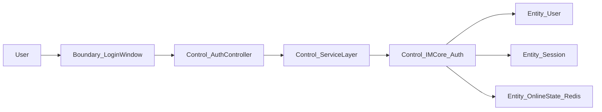

#### 用例：发送文本/代码消息（课程群/小组群）

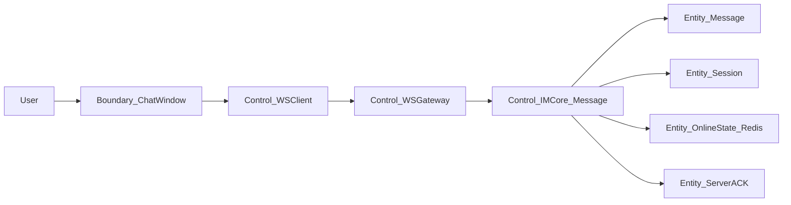

#### 用例：在线接收并展示消息

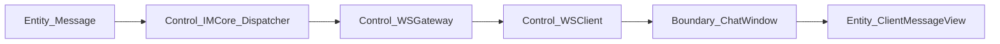

#### 用例：离线消息拉取与补发

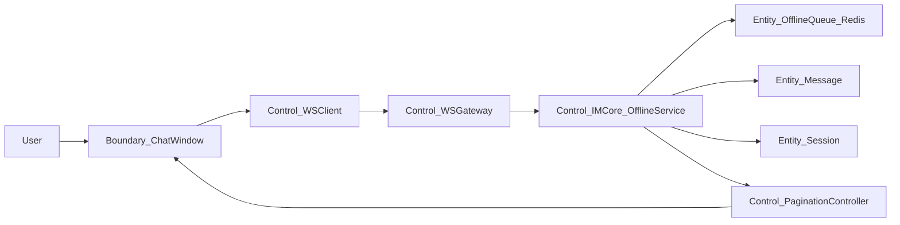

#### 用例：文件上传与群内共享

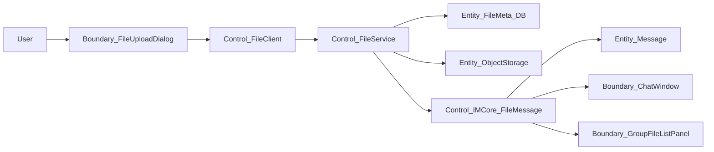

#### 用例：消息搜索与历史查看

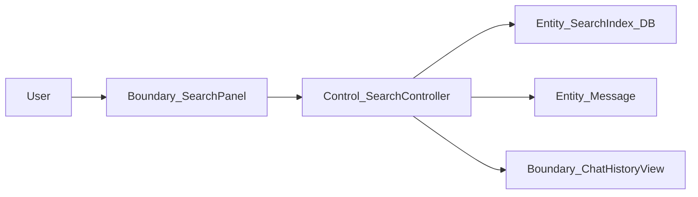

#### 用例：AI 会话摘要生成

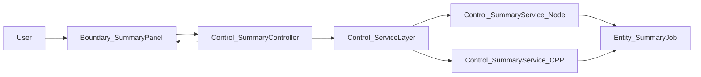

#### 用例：断网/弱网重连与连接状态管理

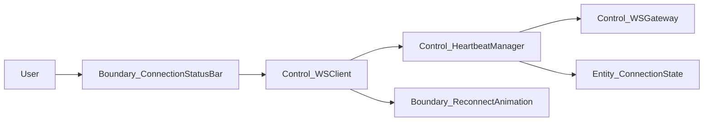

### 4.1.5 系统级健壮性策略总结

结合上述用例层面的健壮性分析，本系统在整体设计上采用以下系统级健壮性策略（均基于蓝图约束与架构）：

- **输入校验策略**  
  - 在 Electron 客户端对登录信息、消息长度、文件大小与类型进行前置校验。  
  - WebSocket 网关与文件服务层对消息格式、协议字段、文件元数据做服务端校验，避免非法请求进入 IM 核心与数据库。

- **网络波动与断线重连处理**  
  - 通过蓝图中定义的心跳机制与断线重连策略，区分短暂抖动与真正断线，避免误杀连接。  
  - 客户端在弱网场景下显示重连动画，并在重连成功后触发离线消息拉取与状态自检。

- **重试机制与超时控制**  
  - 消息发送依赖 Server-ACK，针对未确认消息采用有限次重试，并通过 `seq` 字段保证幂等。  
  - 文件上传、离线拉取、AI 摘要等耗时操作统一设置超时与重试策略，防止无界等待。

- **幂等策略（基于 seq/msgId）**  
  - WebSocket 消息中 `seq` 字段与会话标识共同作为幂等键，确保消息在重试与补发场景下不会重复持久化。  
  - 离线补发与重连后重发均以幂等键去重，保证消息送达率与零丢失目标。  
  - 文件上传与摘要请求在服务层以业务主键去重，避免重复任务与资源浪费。

- **服务降级方案**  
  - AI 会话摘要、搜索、群文件列表等非核心功能在服务不可用或超载时可自动降级：隐藏入口、返回部分数据或仅保留核心 IM 能力。  
  - 当 Redis 状态服务异常时，离线消息与未读计数降级到 MySQL 扫描与批量统计，保证功能可用性。

- **UI 错误提示与交互设计**  
  - 登录、发送消息、文件上传、摘要生成等关键操作均在 UI 上提供明确、可读的错误提示与状态反馈（等待发送、重试中、已失败等）。  
  - 在网络异常时，通过连接状态条与重连动画减少用户焦虑，并引导用户重试或稍后再试。

- **日志与可观测性策略**  
  - 按蓝图「可观测性」方案，在网关、IM 核心、文件服务等组件中使用 JSON 结构化日志记录关键事件（message_forward、reconnect、ack_timeout 等）。  
  - 通过 Tracing 串联「Client → Gateway → IM Core → Redis → MySQL → 文件服务」，定位延迟瓶颈与失败路径。  
  - 利用 Metrics 指标（连接数、消息吞吐、DB 延迟、Redis 命中率等）配合告警，实现对异常场景的快速发现与恢复。

## 4.2 交互建模

### 4.2.1 建模方法说明

本节基于项目所选用的技术栈：桌面客户端 + WebSocket 网关 + IM 核心 + 文件服务架构，对核心用例进行交互建模，全部使用 Mermaid 表达 UML 风格图：

- **页面交互流（flowchart）**：描述从登录到课程/小组会话、文件与任务视图、搜索与摘要等页面间的导航关系。  
- **活动图（flowchart）**：刻画用户操作与系统处理步骤的业务活动流，突出控制分支与异常路径。  
- **序列图（sequenceDiagram）**：对「登录」「发送消息」「接收消息」「文件上传」四个核心用例，展示客户端、网关、IM 核心、Redis/MySQL、文件服务等组件之间的消息时序。  
- **状态机图（stateDiagram）**：针对消息状态与连接状态，建模其状态转移与触发事件，支撑前述健壮性策略。

所有交互模型均以蓝图中的功能规划、协作链路模型与 Demo Flow 为信息源，不引入额外功能。

### 4.2.2 用户交互流程图（Mermaid）

下图基于蓝图「演示脚本」与「协作链路模型」，展示用户在桌面端从启动应用到进入课程群/小组群、进行消息与文件协作，以及在网络异常场景下的主要页面流。

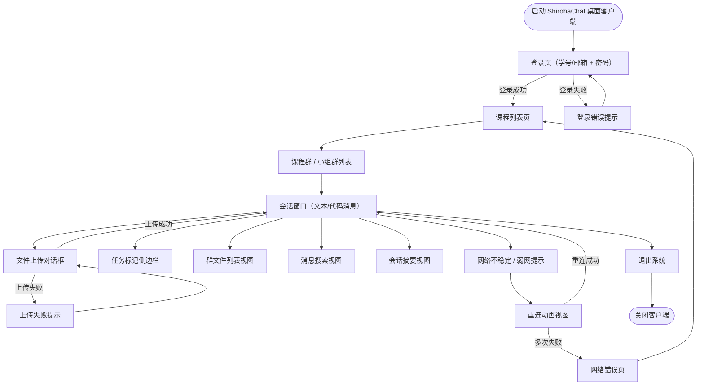

### 4.2.3 系统交互序列图（Mermaid）

#### 用例：登录

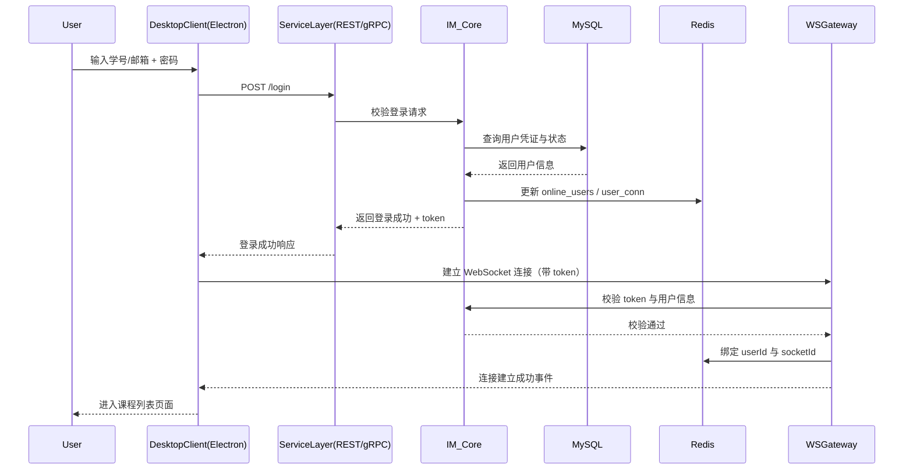

#### 用例：发送消息（文本/代码）

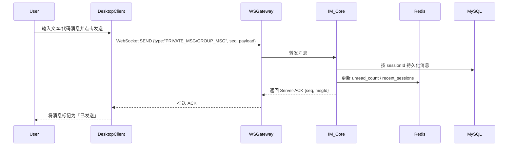

#### 用例：接收消息

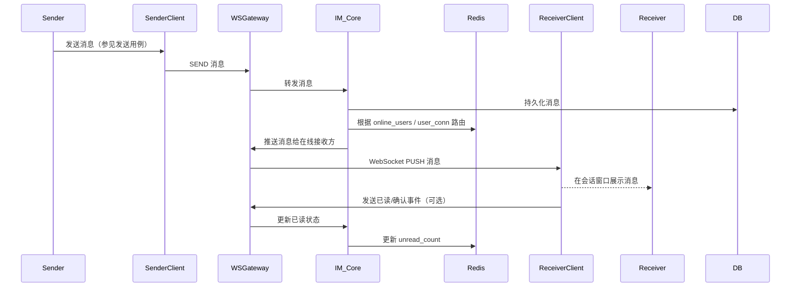

#### 用例：文件上传

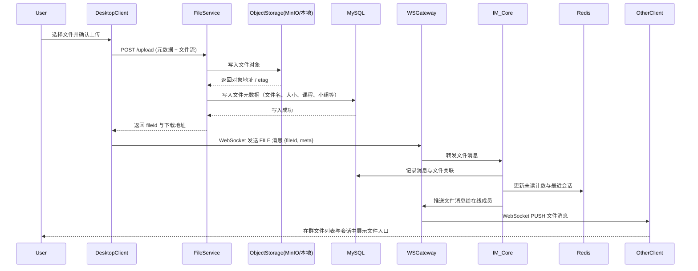

### 4.2.4 状态机图（消息状态、连接状态）

蓝图中明确提出「Server-ACK」「离线消息拉取」「已读/未读状态」「断网/弱网重连」，因此需要对消息状态与连接状态进行状态机建模。

#### 消息状态状态机

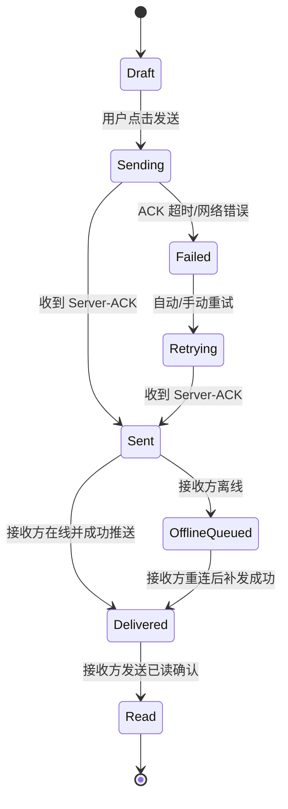

#### 连接状态状态机

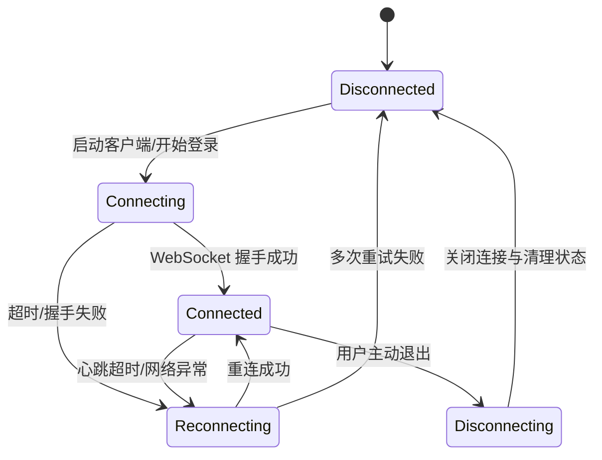

### 4.2.5 交互建模与健壮性的关系总结

- **重试路径的显式建模**  
  - 序列图与状态机中明确了 Server-ACK 失败与重试的时机，使客户端能够在 UI 上将「发送中」「重试中」「失败」状态直观地呈现出来，并与后端幂等策略（基于 `seq`）协同工作。

- **错误提示路径的统一规划**  
  - 页面流与活动流中为登录失败、文件上传失败、搜索失败、摘要服务不可用等场景设计了专门的错误页或提示节点，使异常不会演变为「静默失败」，提升可用性与可恢复性。

- **状态转移对异常场景的补强**  
  - 消息与连接状态机保证了在断网、弱网、服务端重启等场景下依然有清晰的状态演进路径，如 OfflineQueued、Reconnecting 等，以支撑离线补发与重连策略。  
  - 通过状态自检（重连后触发全量同步），避免 Redis 状态与客户端 UI 不一致。

- **服务不可用时的降级与 fallback 流程**  
  - 在交互模型中，AI 摘要、搜索、群文件列表等被视作可降级能力：当对应服务不可用或超载时，页面入口可隐藏或显示「功能暂时不可用」提示，而不会影响核心聊天与文件发送路径。  
  - 对象存储与 MySQL 的异常通过文件服务的补偿流程与群文件视图的降级加载体现出来。

通过以上交互建模，本系统在蓝图给出的技术架构与 NFR 约束下，将健壮性要求前置到界面流与系统交互层面，使得异常场景不再是「补丁式处理」，而是成为可视、可验证的设计组成部分。

---

# 第5章 架构设计

---

# 第6章 详细设计

---

# 后记

---

# 参考文献

---

