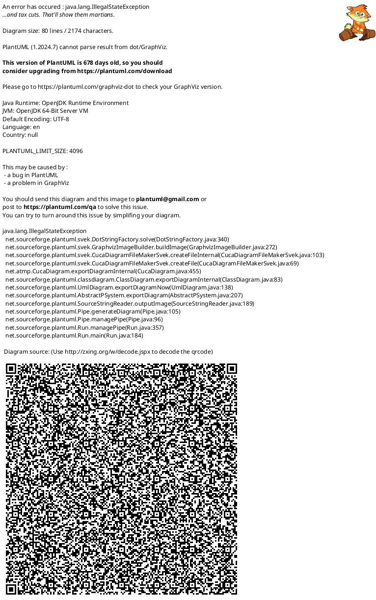

# ShirohaChat 项目文档

## 摘要

在人类沟通长期依赖书信等传统方式的阶段,信息传递的延迟与成本长期存在:跨地域沟通困难、往返周期长,在“等待回信”的过程中,关键信息往往滞后甚至错过最佳时点。手机普及与移动互联网兴起后,人们对“随时联系、即时回应”的需求迅速成为日常生活的刚需,即时通讯由此从工具性产品演进为社会连接的基础设施,以更低成本、更高频率支撑人与人之间更及时、更亲密的沟通。

在这一背景下,本项目拟开发一款面向大众的普适即时通讯工具——ShirohaChat(桌面端)。产品聚焦日常沟通场景,服务朋友、家人、异地恋与同学等社交关系维护需求,围绕“及时触达、顺畅表达、稳定可靠、隐私可控”四个方向构建核心体验,覆盖私聊/群聊、文本/图片/语音/表情与文件发送、离线消息与重连、已读未读与消息搜索等基础能力,满足大众用户对即时联系与低成本连接的长期需求。

在开发过程中,团队基于面向对象分析与设计方法(OOAD)和统一建模语言(UML)进行系统建模,采用客户端-服务器架构(C/S)实现消息实时传递。项目引入**非功能性需求(NFR)**管理、**协议契约设计**、**风险管理矩阵**与**量化性能指标**。系统实现端到端延迟 ≤ 200ms、消息送达率 ≥ 99.99%、单节点支持 ≥ 5000 并发连接,具备断线重连与离线补发机制,确保消息零丢失。

关键词:大众即时通讯,社交沟通,私聊,群聊,离线消息,消息可靠性,低延迟,NFR

---

## 日期 / 修改 / 描述 / 作者

---

## 目录

* 摘要
* 第1章 立项

  * 1.1 项目起源与提案
  * 1.2 Business Case
* 第2章 愿景

  * 2.1 问题陈述
  * 2.2 涉众与用户
  * 2.3 关键涉众和用户的需要
  * 2.4 产品概述
  * 2.5 产品特性
  * 2.6 其他产品需求
* 第3章 用况建模

  * 3.1 术语表
  * 3.2 主要用况
  * 3.3 用况的完整描述
* 第4章 需求分析
* 第5章 架构设计
* 第6章 详细设计
* 后记
* 参考文献

---

# 第1章 立项

## 1.1 项目起源与提案

### 项目背景

在书信等传统沟通方式主导的年代,信息传递延迟高、成本高,跨地域沟通尤为困难,人与人之间的联系往往被时间与距离切割。手机普及后,人们对“随时联系、即时回应”的需求迅速增长,即时通讯成为日常生活的基础设施:它不仅承担信息传递,也承载关系维护、情感表达与社交连接。

在大众沟通场景中,用户对即时通讯的核心期待并不复杂,但要求极高:要快、要稳、要省心、要可信。若基础体验存在短板,会直接放大沟通成本与情绪摩擦,主要体现在三类问题:

**1. 聊天入口多，重要信息难定位**
* 私聊与群聊同时进行,对话入口繁杂
* 约定时间、地址、转账说明等关键信息容易被刷屏淹没
* 回看成本高,错过信息后需要二次确认

**2. 表达与互动能力需要完整覆盖**
大众沟通不仅是“发文字”,还包括语音、图片、表情与文件等多模态表达,并需要引用、转发、撤回等高频互动能力,以降低误解与重复沟通。

**3. 弱网与离线场景下的可靠性与隐私诉求突出**
在网络波动、断线重连、设备切换等场景下,用户更关注“消息是否到达、是否重复、是否丢失”;同时,对隐私设置、黑名单与骚扰拦截也有明确预期。

### 项目定位

> **"一款面向大众的普适桌面端即时通讯工具,聚焦朋友与家人等日常社交关系维护,以低延迟、高可靠与隐私可控为基础,提供私聊/群聊与多媒体表达能力,满足随时联系、即时回应的沟通刚需。"**

### 核心价值主张

* **更及时**:降低“联系到对方”的等待成本,让沟通回到即时与自然的节奏
* **更亲密**:以语音、图片、表情等表达方式承载情绪与关系温度
* **更低成本**:让跨地域沟通与群体沟通不再受制于时间与费用
* **更可靠**:在弱网与断线情况下保持一致体验,尽量减少丢失与重复

## 1.2 Business Case

### 项目目标

开发一款**高性能、高可用**的普适即时通讯系统,采用MoSCoW方法进行功能优先级管理:

#### Must Have (MVP核心)
1. 账号体系(手机号/邮箱注册登录)
2. 联系人体系(添加/删除/备注/黑名单)
3. 私聊/群聊
4. 文本/图片/语音/表情消息
5. 文件发送(小文件)
6. Server-ACK机制
7. 离线消息拉取
8. 桌面客户端

#### Should Have
1. 搜索(按关键词/联系人/群组)
2. 已读/未读与未读计数
3. 置顶会话与消息引用回复
4. 消息撤回与转发

#### Could Have
1. 消息收藏
2. 群公告与群管理(入群方式、禁言、管理员)
3. 断网/弱网重连动画
4. 陌生人消息请求与反骚扰策略(开关、频控、举报)

#### Won't Have (本轮不做)
1. 视频/语音通话
2. 多端同步
3. 实时协作文档

### 预期收益

* **用户价值(大众用户)**:随时联系、即时回应,跨地域沟通成本显著降低,社交关系维护更自然、更稳定
* **用户价值(群体关系)**:群聊信息更清晰,重要信息更不易错过,降低重复确认与误解成本
* **技术价值**:提供零丢失、低延迟(≤200ms)、稳定可靠的实时通讯服务
* **学习价值**:完整展示IM系统的工业级架构设计,包含NFR管理、协议设计、可靠性机制与性能压测方法

### 约束与假设

| 维度   | 约束条件                              |
| ---- | --------------------------------- |

### 非功能性需求 (NFR)

| 维度   | 指标要求            | 验证方法              |
| ---- | --------------- | ----------------- |

---

# 第2章 愿景

## 2.1 问题陈述

### 问题一：即时联系成为刚需,基础体验要求更高

| 要素   | 描述                                                                  |
| ---- | ------------------------------------------------------------------- |
| 问题   | 手机普及后,“随时联系、即时回应”成为大众沟通的基本预期,但在弱网、断线、设备切换与高频群聊等场景下,消息到达与阅读状态不确定、重要信息易错过、回看与检索成本高等问题依然普遍存在。 |
| 影响群体 | 大众用户(朋友、家人、异地恋、同学等社交关系)、需要跨地域保持联系的人群。                                   |
| 后果   | 错过关键信息、反复确认造成沟通疲劳,并在高频互动中引发误解与情绪摩擦,抬高关系维护成本。          |
| 解决方案 | ShirohaChat 聚焦“及时触达与稳定可靠”:提供 Server-ACK、离线补发与断线重连,并配套清晰的未读计数、搜索与隐私/反骚扰设置,让沟通更省心。 |

### 问题二：现有方案的技术局限

| 要素   | 描述                                                 |
| ---- | -------------------------------------------------- |
| 问题   | 主流闭源 IM 系统难以进行架构研究与二次开发，开源方案多为 Demo 级别，缺乏工业级设计。 |
| 影响群体 | 软件工程学习者、系统架构研究者。                                   |
| 后果   | 理论与实践脱节，无法深入理解 WebSocket、消息可靠性、分布式状态管理等核心技术。    |
| 解决方案 | ShirohaChat 开源完整架构设计（含 NFR、协议、风险管理），可作为学习与扩展基础。   |

---

## 2.2 涉众与用户

### 1. 涉众分析

| 涉众类型  | 代表       | 核心诉求                           | 优先级  |
| ----- | -------- | ------------------------------ | ---- |
| 项目团队  | 开发组/测试组  | 掌握工业级 IM 架构设计与实现能力              | 高    |
| 目标用户  | 大众用户     | 稳定、易用的日常即时通讯工具                 | 高    |
| 技术评审者 | 导师/面试官   | 系统展示专业性（架构、性能、文档）              | 高    |
| 潜在扩展者 | 开源社区开发者  | 清晰的代码结构与接口文档                   | 中    |

### 2. 用户画像(典型大众场景)

#### 小周 - 异地恋用户

* **场景**:日常高频私聊,需要在不同时间与地点保持“随时联系、即时回应”
* **痛点**:
  - 弱网或断线时消息状态不明确,容易产生“是否收到”的焦虑
  - 夜间或工作时段需要更细粒度的通知与免打扰控制
  - 希望表达更自然(语音、图片、表情),但不希望操作复杂
* **期望**:消息到达更确定、通知可控、表达顺畅且操作简单

#### 阿慧 - 家庭群组织者

* **场景**:家庭群日常沟通与信息转达(聚餐时间、出行信息、照片分享等)
* **痛点**:
  - 群聊刷屏后重要信息容易被淹没,成员反复询问
  - 老人不熟悉复杂操作,需要更直观的未读与提示
  - 图片与文件较多时,回看与查找成本高
* **期望**:群聊信息更清晰、老人也能轻松使用、历史内容更好找

#### 小林 - 与陌生人沟通的用户

* **场景**:二手交易、兴趣社交等场景下与陌生人短期沟通
* **痛点**:
  - 易收到骚扰信息,需要明确的消息请求与拦截机制
  - 希望能快速建立联系,同时保护隐私
  - 沟通结束后希望一键清理并控制对方可见范围
* **期望**:更强的反骚扰与隐私设置、陌生人沟通更安全可控

---

## 2.3 关键涉众和用户的需要

| 涉众/用户 | 核心需求                            | 系统响应                        |
| ----- | ------------------------------- | --------------------------- |
| 大众用户  | 低延迟、消息可靠到达、离线补发、通知可控、隐私与反骚扰      | Server-ACK + 离线补发 + 未读计数/搜索 + 黑名单/消息请求  |
| 开发者   | 模块化架构、清晰接口文档、易于扩展               | API文档 + 分层设计 + 代码规范  |
| 评审者   | 展示系统专业性（性能指标、架构图、风险管理）          | NFR 量化 + 压测报告 + UML建模     |
| 运维者   | 一键部署、监控日志、故障恢复                  | 容器化部署 + 日志系统      |

---

## 2.4 产品概述

### 1. 产品定位陈述 (Elevator Pitch)

> **For** 大众用户(朋友、家人、异地恋、同学与陌生人沟通场景)  
> **Who** 在跨地域与高频社交沟通中需要“随时联系、即时回应”,并希望消息更可靠、通知更可控、隐私更安心  
> **The** ShirohaChat  
> **Is a** 面向大众的桌面端即时通讯工具  
> **That** 提供私聊/群聊、多媒体消息、未读与搜索、黑名单与消息请求等能力,并以 Server-ACK 与离线补发保证消息可靠送达  
> **Unlike** 微信(功能堆叠、入口复杂)、QQ(界面复杂、广告干扰)、Discord(国内访问难)  
> **Our product** 以“简洁、可靠、可控”为优先,同时保证消息可靠性≥99.99%、端到端延迟≤200ms,提供更聚焦的桌面端沟通体验

### 2. 完整的产品概述

ShirohaChat 是一款**面向大众的即时通讯系统(桌面端)**,采用前后端分离的 C/S 架构:

* **前端**:桌面客户端,提供联系人与会话列表,支持文本/图片/语音/表情与文件消息展示,并提供搜索与未读管理
* **后端**:实时通讯服务,实现Server-ACK、离线消息队列、在线状态与重连机制
* **数据层**:持久化存储用户/群组/消息数据,缓存在线状态与离线消息队列
* **核心特性**:
  - **日常沟通**:私聊/群聊、多媒体消息、引用回复与转发
  - **信息管理**:未读计数、消息搜索、置顶会话与收藏
  - **隐私与安全**:黑名单、陌生人消息请求、基础反骚扰策略
  - **消息可靠性**:Server-ACK机制、离线补发、消息零丢失(≥99.99%)
  - **高性能**:端到端延迟≤200ms,单节点支持≥5000并发连接

---

## 2.5 产品特性

| 优先级      | 功能模块             | 具体特性                             | 技术实现                    |
| -------- | ---------------- | -------------------------------- | ----------------------- |

---

## 2.6 其他产品需求

### 2.6.1 性能需求 (Performance)

| 指标       | 目标值       | 测试方法                         |
| -------- | --------- | ---------------------------- |

### 2.6.2 可靠性需求 (Reliability)

| 指标     | 目标值      | 实现方式                  |
| ------ | -------- | --------------------- |

### 2.6.3 兼容性需求 (Compatibility)

### 2.6.4 安全性需求 (Security)

| 威胁类型  | 防护措施                    |
| ----- | ----------------------- |

### 2.6.5 可维护性需求 (Maintainability)

### 2.6.6 可扩展性需求 (Scalability)

---

# 第3章 用况建模

## 3.1 术语表

| 术语 | 描述 |
| --- | --- |
| 用户（User） | 使用聊天系统的注册使用者 |
| 好友（Friend） | 与用户建立双向连接关系的其他用户 |
| 群聊（Group Chat） | 由多个用户组成的消息会话 |
| 消息（Message） | 文本、图片、文件或表情形式的数据 |
| Emoji | 图形表情符号，用于丰富聊天内容 |

---

## 3.2 ShirohaChat 的主要用况

---

## 3.3 主要用况的描述

### 3.3.1 即时通讯（聊天）

- **简要描述**：该用况描述用户选择会话、发送文本消息、查看实时反馈以及接收对方消息的完整交互过程。
- **用况图**：待补充。

**前置条件**

1. 用户已登录系统。
2. 用户的网络连接状态正常。
3. 用户的联系人列表中至少存在一个好友或群组。

**基本流（Basic Flow）**

{进入会话}  
1. 用户在主界面的会话列表中，选择一个联系人或群组进行点击。  
2. 系统打开该会话的聊天窗口，并显示之前的历史聊天记录。  

{编辑与发送}  
3. 用户在输入框中输入文本消息。  
4. 用户点击“发送”按钮（或按下回车键）。  
5. 系统对消息内容进行基本验证（如内容不为空）。  
6. 系统在聊天窗口中立即显示该条消息，并由系统显示“发送中”的状态标识。  
7. 系统在确认消息送达后，将消息状态更新为“已送达”标识。  

{接收消息}  
8. 系统在聊天窗口中实时显示对方发来的新消息。  
9. 系统自动滚动聊天视图以展示最新内容。  

**备选流 (Alternative Flows)**

- A1：收到来自其他会话的消息  
  1. 系统在左侧会话列表中，将新消息来源的会话置顶。  
  2. 系统在该会话项上显示未读消息提示（如红点或数字）。  
  3. 用户继续在当前窗口操作，不受干扰。  

- A2：查看历史消息  
  1. 用户向上滚动聊天窗口。  
  2. 系统加载并显示更早之前的聊天记录。  
  3. 用户停止滚动，用况恢复到当前步骤。  

**异常流 (Exception Flows)**

- E1：发送空消息  
  1. 系统检测到内容无效。  
  2. 系统保持发送按钮不可点击，或弹出提示“无法发送空内容”。  
  3. 用况回到基本流步骤 3。  

- E2：发送失败（网络异常）  
  1. 系统在超时或检测到断开后，将该消息的状态标识更新为“发送失败”（如红色感叹号）。  
  2. 用户点击该“失败标识”。  
  3. 系统尝试重新发送。  
     - E2a 重发成功：用况回到基本流步骤 7。  
     - E2b 重发失败：系统再次显示“失败标识”，等待用户下一次操作。  

**后置条件 (Post-conditions)**

- 成功：消息内容被系统存储，且界面显示“已送达”。  
- 失败：消息内容被本地保存（不丢失），界面显示“发送失败”。  

---

### 3.3.2 公共流（Common Flows）

#### UC-01：注册账户 (Register Account)

1. **简要描述**：该用况描述用户首次使用系统时，填写身份信息并创建新账户的全过程。  
2. **前置条件**：用户尚未拥有本系统账户；系统服务处于可用状态。  
3. **基本流**  
   1) 用户打开应用，点击“注册”按钮。  
   2) 系统显示注册界面，包含账号、密码、确认密码、昵称输入框。  
   3) 用户填写上述信息并提交。  
   4) 系统对输入内容进行格式校验（如长度、复杂度）。  
   5) 系统检查账号是否已被占用。  
   6) 系统确认创建新账户成功。  
   7) 系统提示“注册成功”。  
   8) 用户选择跳转至登录界面。  
4. **备选流 / 异常流**  
   - A1：账号已存在 → 系统提示“该账号已被注册”，并停留在注册界面。  
   - A2：密码不一致 → 系统提示“两次输入的密码不一致”。  
   - A3：输入不合规 → 系统提示具体的格式错误（如“密码需包含字母与数字”、“必填项不能为空”）。  
   - A5：服务不可用 → 系统提示“注册服务暂时不可用，请稍后重试”。  

#### UC-02：登录系统 (Login)

1. **简要描述**：该用况描述用户使用已有账户进入系统主界面的过程。  
2. **前置条件**：用户已完成注册；用户的网络连接正常。  
3. **基本流**  
   1) 用户启动应用进入登录界面。  
   2) 用户输入账号与密码并点击“登录”。  
   3) 系统检查输入格式是否有效。  
   4) 系统验证账号与密码的正确性。  
   5) 系统验证通过，开始初始化用户数据。  
   6) 系统建立与聊天服务器的连接。  
   7) 系统跳转到主界面，显示会话列表。  

---

# 第4章 需求分析

## 4.1 健壮性分析（Robustness Analysis）

### 4.1.1 分析类清单

| 用况 | Boundary（边界类） | Control（控制类） | Entity（实体类） |
| --- | --- | --- | --- |
| UC-01 注册账户 | `RegisterView`、`MessageServerAPI` | `RegisterController` | `UserAccount` |
| UC-02 登录系统 | `LoginView`、`MainWindow`、`MessageServerAPI`、`MessageStore` | `LoginController`、`ConnectionManager` | `UserSession` |
| UC-03 即时通讯（聊天） | `ConversationListView`、`ChatWindow`、`MessageServerAPI`、`MessageStore` | `ChatController` | `ChatSession`、`Message` |

### 4.1.2 分析类字典 (Analysis Class Dictionary)

#### 边界类（Boundary / `<<boundary>>`）

**`RegisterView`（注册界面）**  
- 职责（Responsibilities）：  
  - 展示注册表单并采集输入（账号、密码、确认密码、昵称）。  
  - 将提交动作转化为 `registerAccount(...)` 请求交给 `RegisterController`。  
  - 展示输入不合规/账号已存在等错误信息，并在成功后引导用户进入登录界面。  
- 业务作用：提供账户创建入口，使“注册”这一公共流在界面上可被完成、可被纠错、可被确认。  
- 归类理由：该对象直接与参与者交互，主要负责输入输出与界面反馈，不承载用况控制与领域状态，属于边界类。  

**`LoginView`（登录界面）**  
- 职责（Responsibilities）：  
  - 展示登录表单并采集账号与密码。  
  - 将登录动作转化为 `login(...)` 请求交给 `LoginController`。  
  - 展示认证失败原因，并在成功时导航进入主界面。  
- 业务作用：作为系统入口承接认证体验，明确反馈“能否进入系统”。  
- 归类理由：面向参与者的交互界面，负责呈现与触发，不保存持久业务信息，也不做业务决策，属于边界类。  

**`MainWindow`（主界面）**  
- 职责（Responsibilities）：  
  - 作为应用主容器承载核心模块（会话列表、聊天区域等）。  
  - 在登录成功后展示主界面并提供会话入口（如 `showHome(...)`、`openChat(...)`）。  
- 业务作用：提供稳定的“任务工作台”，支撑用户在会话之间切换并持续使用聊天能力。  
- 归类理由：该对象是 UI 导航与布局容器，主要承担与用户的界面交互，不承担用况编排与领域数据管理，属于边界类。  

**`ConversationListView`（会话列表）**  
- 职责（Responsibilities）：  
  - 展示用户可访问的会话列表与未读计数。  
  - 将会话选择动作转化为 `openConversation(sessionId)` 交给 `ChatController`。  
  - 在新消息到达时提升会话并更新未读提示（`promoteSession(...)`、`updateUnread(...)`）。  
- 业务作用：对应文档中“入口多、重要信息难定位”的痛点，通过排序与未读提示帮助用户快速定位对话。  
- 归类理由：与参与者直接交互、以信息呈现与交互事件为主，不负责消息一致性与业务规则判断，属于边界类。  

**`ChatWindow`（聊天窗口）**  
- 职责（Responsibilities）：  
  - 展示消息历史与实时消息流（`displayHistory(...)`、`appendIncoming(...)`）。  
  - 接收用户输入并触发发送（`submitText(...)`），并呈现发送状态与错误提示（`appendOutgoing(...)`、`updateDeliveryStatus(...)`、`showEmptyWarning()`）。  
  - 提供历史回看交互入口（滚动触发 `prependHistory(...)`）。  
- 业务作用：承载“即时通讯（聊天）”用况中用户感知最强的交互环节：发送、接收、状态反馈与历史浏览。  
- 归类理由：该对象承担界面呈现与交互事件采集；消息可靠性、状态迁移等业务决策由控制/实体承担，属于边界类。  

**`MessageStore`（本地存储接口）**  
- 职责（Responsibilities）：  
  - 封装对本地持久化资源的访问（保存/查询/分页/更新状态等）。  
  - 为 `LoginController` 提供同步数据落库能力（`saveSyncData(...)`）。  
  - 为 `ChatController` 提供消息与历史查询能力（`loadRecentHistory(...)`、`loadOlderHistory(...)`、`loadMessage(...)`）及状态更新能力（`updateDeliveryStatus(...)`）。  
- 业务作用：把“历史可回看、离线可恢复、状态可追踪”等需求落实为可用的数据访问能力，降低弱网/断线对体验的影响。  
- 归类理由：在分析模型中，本地数据库/文件系统属于系统外部资源；`MessageStore` 的职责是作为访问该资源的接口与适配层，符合边界类特征。  

**`MessageServerAPI`（消息服务接口）**  
- 职责（Responsibilities）：  
  - 提供对外部 IM 服务的访问接口：认证、账号检查与创建、连接建立、消息发送、初始同步、历史拉取。  
  - 接收服务端推送/回执并将事件回调交付给 `ChatController`（如 `onAckReceived`、`onSendFailed`、`receiveIncoming`）。  
- 业务作用：隔离网络协议与外部服务差异，使控制类聚焦表达“业务意图”（认证/发送/同步）而非通信细节。  
- 归类理由：它是系统与外部 IM 服务交互的边界对象，负责协议适配与事件传递，不做用况编排与领域决策，属于边界类。  

#### 控制类（Control / `<<control>>`）

**`RegisterController`（注册控制器）**  
- 职责（Responsibilities）：  
  - 编排 UC-01 注册用况：接收注册请求、执行输入校验、发起账号检查与创建、驱动界面反馈与跳转。  
  - 在校验失败/账号占用等分支中做出控制决策（继续编辑 vs. 结束用况）。  
  - 在账号创建成功后初始化 `UserAccount` 实体，使“注册结果”沉淀为可识别的领域对象。  
- 业务作用：保证注册流程的顺序一致与分支一致，避免 UI 直接面对外部服务与领域对象而产生耦合。  
- 归类理由：该对象的核心是用况流程控制与协调，典型属于控制类。  

**`LoginController`（登录控制器）**  
- 职责（Responsibilities）：  
  - 编排 UC-02 登录用况：发起认证、处理成功/失败、创建会话上下文并进入主界面。  
  - 组织“登录后初始化”：建立连接、请求初始同步、驱动本地落库与主界面展示。  
- 业务作用：把登录从“单次认证”扩展为“进入可用运行态”的完整流程，保证进入主界面前关键数据与连接已就绪。  
- 归类理由：负责跨边界对象（服务接口/本地存储/主界面）与实体对象（会话）的协调与控制，属于控制类。  

**`ConnectionManager`（连接管理器）**  
- 职责（Responsibilities）：  
  - 管理连接的建立与维持（`connect(...)`、`maintainConnection()`），为上层提供稳定的连接状态。  
  - 通过 `MessageServerAPI` 建立与 IM 服务的实时通道，并在异常情况下提供重连/保持策略的落点。  
- 业务作用：把“弱网与断线重连”的横切关注点从具体用况中抽离，提高系统健壮性与复用性。  
- 归类理由：负责对系统资源（连接通道）进行协调与策略控制，不表达持久领域概念，属于控制类。  

**`ChatController`（聊天控制器）**  
- 职责（Responsibilities）：  
  - 编排 UC-03 聊天用况：打开会话、加载历史、发送/重发消息、处理接收消息与会话列表更新。  
  - 通过 `MessageStore` 完成“先落库/再展示”的一致性策略，并更新投递状态。  
  - 通过 `MessageServerAPI` 发送消息与拉取历史，并处理异步事件回调（ACK、发送失败、服务端推送）。  
- 业务作用：统一管理即时通讯交互的控制流，保证“状态可见、消息不丢、未读可控、历史可回看”。  
- 归类理由：以用况编排与对象协作为核心，而非承载业务数据本体，属于控制类。  

#### 实体类（Entity / `<<entity>>`）

**`UserAccount`（用户账号）**  
- 职责（Responsibilities）：  
  - 表达注册用户的稳定身份（账号标识）与基础资料（昵称）。  
  - 在注册成功后作为领域对象被创建/初始化，为后续登录与会话建立提供身份依据。  
- 业务作用：统一承载“账号体系”的核心信息，支撑注册与登录两个公共流。  
- 归类理由：具备稳定标识且需要长期存在（可被持久化与引用），属于实体类。  

**`UserSession`（用户会话）**  
- 职责（Responsibilities）：  
  - 保存认证后生成的会话令牌与过期时间，表达“已认证上下文”。  
  - 维护连接状态（`connectionState`），为消息收发与重连策略提供状态基线。  
- 业务作用：把“用户已登录”落实为可管理的数据对象，并作为进入主界面与后续通信的运行时上下文。  
- 归类理由：会话具备可识别性（token）与随时间演化的状态，需要被一致管理，属于实体类。  

**`ChatSession`（会话/对话）**  
- 职责（Responsibilities）：  
  - 表达对话会话的标识与类型（私聊/群聊），并维护未读计数。  
  - 提供未读计数的基本行为（`incrementUnread()`、`resetUnread()`）。  
- 业务作用：作为会话列表中的“入口对象”，支撑选择进入、未读提示与会话提升。  
- 归类理由：具备稳定标识（sessionId）并可被持久化与引用，属于实体类。  

**`Message`（消息）**  
- 职责（Responsibilities）：  
  - 表达消息内容与元数据（类型、时间戳、投递状态）。  
  - 通过 `messageId` 支撑 Server-ACK、失败重试与去重等可靠性机制。  
  - 提供投递状态迁移的核心行为（`markSending()`、`markDelivered()`、`markFailed(...)`）。  
- 业务作用：即时通讯的核心业务对象，直接对应用户的“表达内容”与系统的“投递反馈”。  
- 归类理由：消息具有唯一标识、可持久存储、可检索与可追踪状态，属于实体类。  

#### 值对象/枚举（用于约束领域状态）

- `DeliveryStatus`：约束消息投递状态（Sending/Delivered/Failed/Read），对应聊天用况中的“发送中/已送达/发送失败/已读”等用户可感知状态。  
- `MessageType`：约束消息形态（Text/Image/Voice/Emoji/File），对应多模态表达需求。  
- `SessionType`：区分私聊与群聊（Private/Group），影响参与者规模与业务规则。  
- `ConnectionState`：表达连接状态机（Disconnected/Connecting/Connected/Reconnecting），支撑重连与状态展示。  

---

## 4.2 用况实现（Use Case Realization）

### 4.2.1 UC-01：注册账户（Register Account）

#### 4.2.1.1 交互逻辑叙述 (Interaction Narrative)

注册用况的控制流由 `RegisterController` 统一驱动。用户在 `RegisterView` 上发起“点击注册”并提交表单后，`RegisterView` 将账号、密码、确认密码与昵称作为一次完整请求调用 `RegisterController.registerAccount(...)`，从而把界面事件与用况流程解耦。

`RegisterController` 首先在控制层完成输入校验（时序图中以 `validateRegistrationInput(...)` 的自调用体现）：若校验失败，控制器立即回到 `RegisterView` 触发 `showValidationError(reason)`，流程在界面层结束，不产生对外部系统的副作用。若本地校验通过，控制器再通过系统边界 `MessageServerAPI` 发起 `checkAccountAvailability(accountId)`，由边界对象与外部 `IMServer` 完成占用检查并返回结果。

占用检查结果返回后，控制器根据业务分支继续控制：账号已存在则回到 `RegisterView` 给出明确错误提示；账号可用则继续通过 `MessageServerAPI.createAccount(...)` 发起创建账号请求。只有当外部系统确认创建成功后，控制器才在系统内部创建并初始化 `UserAccount` 实体（`create UA`、`UA.initialize(...)`），把注册结果固化为可识别的领域对象，随后驱动 `RegisterView` 展示成功并导航到登录界面，完成用况闭环。

### 4.2.2 UC-02：登录系统（Login）

#### （A）认证阶段（简图）

##### 交互逻辑叙述：认证阶段

认证阶段的目标是判定凭证有效性并获取后续初始化所需的会话数据。用户在 `LoginView` 输入账号与密码并点击登录后，`LoginView` 将凭证提交给 `LoginController.login(...)`。控制器不直接与外部服务交互，而是通过边界对象 `MessageServerAPI.authenticate(...)` 请求外部 `IMServer` 完成认证，返回 `authResult(success, token, profile, expiry)`。

若认证失败，控制流由 `LoginController` 回到 `LoginView` 执行 `showLoginError(reason)`，用况在“留在登录界面并提示原因”处结束。若认证成功，控制器触发 `LoginView.navigateToMain()` 进入下一阶段；此处的“进入主界面”并不等同于系统已可用运行态，真正的连接建立、同步与落库在后续“初始化阶段”完成。

#### （B）初始化与进入主界面（细化）

##### 交互逻辑叙述：初始化与进入主界面

初始化阶段由 `LoginController` 承接认证阶段返回的数据（token、expiry、profile），将“登录成功”转化为系统内部可操作的运行态。首先，控制器初始化 `UserSession` 实体（`Session.initialize(token,expiry,profile)`），使会话令牌、过期时间与用户资料具备明确的数据归属；`UserSession` 同时为后续连接状态管理提供载体。

随后，控制器将“建立实时通道”的横切职责委派给 `ConnectionManager.connect(token)`。连接管理器通过 `MessageServerAPI.establishConnection(token)` 与外部 `IMServer` 建立连接并等待确认，连接成功后以 `connectionReady` 的形式回告控制器，确保后续同步建立在稳定连接之上。

连接就绪后，`LoginController` 通过 `MessageServerAPI.requestInitialSync(token)` 请求初始同步数据（会话列表与离线消息）。同步数据返回后，控制器调用 `MessageStore.saveSyncData(conversations,offlineMessages)` 将关键业务数据落入本地持久化资源，保证主界面的展示与后续查询不依赖瞬时网络结果。最后，控制器驱动 `MainWindow.showHome(conversations)` 展示主界面并呈现会话列表，完成“从认证到可用主界面”的登录闭环。

### 4.2.3 UC-03：即时通讯（聊天）

#### 4.2.3.1 交互逻辑叙述 (Interaction Narrative)

聊天用况的控制核心是 `ChatController`。它一方面接收来自界面组件（`ConversationListView`、`ChatWindow`）的用户意图，另一方面接收来自系统边界（`MessageServerAPI`）的异步事件（新消息推送、ACK、发送失败），并通过 `MessageStore` 保障本地数据一致性与可回看性，从而把“即时性”与“可靠性”统一在同一条控制流上。

在“进入会话”阶段，用户从 `ConversationListView` 选择会话后，边界对象把 `sessionId` 交给 `ChatController.openConversation(sessionId)`。控制器随即通过 `MessageStore.loadRecentHistory(sessionId)` 获取最近消息集合，并将结果提交给 `ChatWindow.displayHistory(messages)` 完成展示。该路径强调“控制器编排、存储提供数据、界面负责呈现”的分工，避免界面直接访问持久化资源导致耦合与一致性问题。

在“编辑与发送”阶段，用户在 `ChatWindow` 提交输入内容后，`ChatWindow` 以 `submitMessage(sessionId, content)` 将意图交给 `ChatController`。控制器首先进行用况级有效性判断：内容为空则直接回到界面执行 `showEmptyWarning()`（异常流 E1），流程终止在界面层且不产生外部副作用。内容有效时，控制器先调用 `MessageStore.saveOutgoing(message)` 完成“先落库”，并立即驱动界面 `appendOutgoing(message, Sending)` 呈现“发送中”，使用户获得即时反馈；随后控制器通过 `MessageServerAPI.sendMessage(message)` 向外部 `IMServer` 投递消息。

投递结果以异步事件形式返回：当服务端 ACK 到达（`serverAck(messageId)`）时，`MessageServerAPI` 回调 `ChatController.onAckReceived(messageId)`，控制器据此将本地存储中的消息状态更新为 `Delivered`（`updateDeliveryStatus(...)`），并同步更新界面展示（`ChatWindow.updateDeliveryStatus(...)`），完成“发送中→已送达”的状态闭环。若出现网络异常或超时（异常流 E2），`MessageServerAPI` 回调 `ChatController.onSendFailed(messageId, reason)`，控制器将状态更新为 `Failed` 并刷新界面；用户触发重试时，控制器通过 `MessageStore.loadMessage(messageId)` 取回同一条消息对象再次调用 `sendMessage(...)`，在 ACK 后回收状态为 `Delivered`，以保证重试过程可追踪、可去重且对用户可理解。

在“接收消息”阶段，外部 `IMServer` 推送新消息到 `MessageServerAPI`，边界对象将消息交付给 `ChatController.receiveIncoming(message)`。控制器先执行 `MessageStore.saveIncoming(message)` 以保证消息落库与可回看，然后根据当前界面上下文分流：若当前会话处于打开状态则直接驱动 `ChatWindow.appendIncoming(message)`；若来自其他会话（备选流 A1），则通过 `ConversationListView.promoteSession(sessionId)` 与 `updateUnread(...)` 更新列表排序与未读计数，实现“不中断当前对话但不遗漏提醒”。

在“查看历史消息”阶段（备选流 A2），用户上滚触发 `ChatWindow` 向控制器发出 `requestOlderHistory(sessionId, beforeMessageId)`。控制器优先通过 `MessageStore.loadOlderHistory(...)` 获取本地历史：本地命中则直接 `prependHistory(olderMessages)`；本地不足时，通过 `MessageServerAPI.requestHistory(...)` 请求服务端历史页，返回后先 `saveHistory(...)` 再 `prependHistory(...)`。该“先存后显”的顺序确保历史分页与后续检索/状态更新都建立在一致的本地数据上。

---

## 4.3 静态分析模型（Analysis Class Diagram）

### 4.3.1 总体概览图（Level 1）

### 4.3.2 详细子图（Level 2）：Boundary / Control

### 4.3.3 详细子图（Level 2）：Entity / Relationship

### 4.3.4 静态结构解析 (Static Structure Rationale)

#### 4.3.4.1 关联关系与多重性（Relationships & Multiplicity）

1. **三层分工的主链路：Boundary → Control →（Boundary/Entity）**  
在 Level 1/Level 2 图中，界面边界（如 `RegisterView`、`LoginView`、`ConversationListView`、`ChatWindow`）以依赖方式指向控制类（`RegisterController`、`LoginController`、`ChatController`）。这种结构把用况步骤与分支集中在控制层，界面层保持“采集意图 + 展示结果”的被动特征，降低 UI 复杂度并提升一致性。控制类再分别访问两类边界：对外部系统的 `MessageServerAPI` 与对本地持久化资源的 `MessageStore`，从而在分析层清晰区分“业务编排”与“资源访问”。  

2. **`MessageServerAPI` → `ChatController` 的回调依赖**  
类图中 `MessageServerAPI --> ChatController : callbacks` 用于表达即时通讯的异步特性：新消息推送、ACK 回执、发送失败并非由用户同步触发。将回调落点设置为 `ChatController`，意味着所有异步事件都进入同一控制点统一处理（落库、更新界面、更新未读/排序），避免边界对象直接操作实体导致跨层耦合与一致性缺口。  

3. **`UserAccount` 与 `UserSession`（`UserAccount "1" <-- "0..1" UserSession`）**  
该多重性表达“账号”与“会话运行态”的解耦：在客户端语境下，账号可能存在但未登录，因此会话对账号的关联为 `0..1`；一旦存在会话，则该会话必须指向且仅指向一个当前用户（`UserAccount "1"`）。这种设计便于表达“未登录/已登录”的状态切换，也为后续支持登出、会话过期与重新登录预留结构空间。  

4. **`UserSession` 聚合可访问会话（`UserSession "1" o-- "0..*" ChatSession`）**  
登录会话作为当前运行上下文，可访问多个对话（私聊/群聊）。用聚合（`o--`）强调“会话列表属于当前会话上下文的组织结果”，并不强制 `ChatSession` 的生命周期必须跟随 `UserSession` 一同销毁；这符合即时通讯中“对话可长期存在、但访问需要登录态”的业务事实。  

5. **`ChatSession` 组合消息集合（`ChatSession "1" *-- "0..*" Message`）**  
消息必须归属某个会话，其展示、分页与未读计算都以会话为语境；因此采用组合（`*--`）强调消息与会话上下文的强归属关系。在分析层这等价于：如果一个会话被移除，其消息集合在业务上也失去归属与可见性。  

6. **参与关系与最低参与者约束（`UserAccount "0..*" -- "2..*" ChatSession`）**  
一个用户可参与多个会话（`0..*`），而一个会话至少包含两名参与者（私聊 2 人，群聊大于 2 人），因此会话侧采用 `2..*`。该约束直接支撑“私聊/群聊”的统一抽象，也为后续成员管理、权限边界提供结构基础。  

7. **实体到枚举的依赖（Entity → Enum）**  
`UserSession → ConnectionState`、`ChatSession → SessionType`、`Message → MessageType/DeliveryStatus` 明确了关键状态与分类的取值域，避免在控制逻辑中散落硬编码常量，使状态迁移（如 `markDelivered()`）在语义层保持一致且可验证。  

#### 4.3.4.2 主要实体类核心属性与业务信息映射

| 实体类 | 核心属性 | 业务含义 | 对应的用况/业务信息 |
| --- | --- | --- | --- |
| `UserAccount` | `accountId: String` | 用户账号标识（手机号/邮箱等） | UC-01 注册表单“账号”；UC-02 登录凭证“账号” |
| `UserAccount` | `nickname: String` | 用户展示名 | UC-01 注册表单“昵称” |
| `UserSession` | `sessionToken: String` | 登录成功后的会话令牌，用于建立连接与鉴权调用 | UC-02 认证阶段返回 `token`；初始化阶段用其 `connect(...)` 与 `requestInitialSync(...)` |
| `UserSession` | `expiresAt: DateTime` | 会话过期时间，用于判定会话是否仍有效 | UC-02 认证阶段返回 `expiry`；用于会话生命周期管理（超时/重新登录） |
| `UserSession` | `connectionState: ConnectionState` | 连接状态（未连接/连接中/已连接/重连中） | UC-02 初始化阶段建立连接；UC-03 前置条件“网络连接状态正常”与弱网重连诉求 |
| `ChatSession` | `sessionId: String` | 会话标识（对话入口与消息归属） | UC-03 进入会话选择 `sessionId`；历史查询按 `sessionId` 分页 |
| `ChatSession` | `type: SessionType` | 私聊/群聊区分 | 产品特性“私聊/群聊”；UC-03 前置条件包含好友或群组 |
| `ChatSession` | `unreadCount: int` | 未读计数，用于列表提示与会话排序 | UC-03 备选流 A1：未读提示与会话置顶/提升 |
| `Message` | `messageId: String` | 消息唯一标识，支撑 ACK、重试与去重 | UC-03 Server-ACK 更新状态；异常流 E2 重试发送依赖 `messageId` |
| `Message` | `content: String` | 消息内容载体 | UC-03 基本流：提交文本内容并发送 |
| `Message` | `type: MessageType` | 消息类型（文本/图片/语音/表情/文件） | 业务需求：多模态消息；展示与处理需按类型分流 |
| `Message` | `createdAt: DateTime` | 消息产生时间，用于排序与历史浏览 | UC-03 查看历史消息分页与时间线展示 |
| `Message` | `deliveryStatus: DeliveryStatus` | 投递状态（Sending/Delivered/Failed/Read） | UC-03 基本流：发送中→已送达；异常流 E2：发送失败；可扩展到已读 |

# 第5章 架构设计

---

# 第6章 详细设计

---

# 后记

---

# 参考文献

---
